# exhentai-manga-manager 详细实现逻辑

> 适用版本:**v1.10.1**(docker-ds 修改版) · 对应仓库 `universc/exhentai-manga-manager--docker-ds`
> 本文面向需要修改/排障的开发者,按「启动 → 设置 → 鉴权 → 数据 → 构建」的顺序自底向上说明实现逻辑。
> 文中 `文件:行号` 均为 v1.10.1 源码中的位置(行号会随改动漂移,请以函数名/关键字检索为准)。

---

## 目录

| 章节 | 内容 |
|---|---|
| [1. 总览](#1-总览) | 三种运行形态、模块拓扑、分层职责 |
| [2. 启动流程](#2-启动流程) | 入口差异、数据目录决策树、容器路径映射、数据库初始化 |
| [3. 设置系统](#3-设置系统) | 三处默认值、原子写入、合并语义、事故复盘 |
| [4. 账户与会话](#4-账户与会话) | users.json、scrypt、会话持久化、鉴权矩阵、IP 规则 |
| [5. 文件与图片服务](#5-文件与图片服务) | 允许根目录、缓存策略、目录浏览页、前端路径改写 |
| [6. IPC 与事件](#6-ipc-与事件) | 桌面 IPC、网页 HTTP 桥、SSE 广播、通道全表 |
| [7. 远程桌面模式](#7-远程桌面模式) | 本地代理、路由拦截、会话持久化、设置拆分 |
| [8. 漫画库](#8-漫画库) | 数据模型、三类存储、全量/增量扫描、封面懒加载、路径互译 |
| [9. 前端实现](#9-前端实现) | 状态管理、界面模式、标签系统、阅读器 |
| [10. AI 功能](#10-ai-功能) | 配置档、标题翻译、信息处理、超分/OCR/上色 |
| [11. 构建与部署](#11-构建与部署) | Docker 多阶段构建、entrypoint、Windows 打包、发版流程 |
| [12. 排障手册](#12-排障手册) | 按现象检索的决策树 |
| [13. 附录](#13-附录) | 文件清单、IPC 全表、设置项分组、安全边界 |

---

## 1. 总览

### 1.1 一句话架构

**一套 Vue 3 前端 + 一套 Node 主进程逻辑**,通过「IPC 抽象层」在两种宿主中运行:
Electron 宿主(桌面客户端)用 `ipcMain`/`ipcRenderer`,纯 Node 宿主(Docker 网页版)用 `Express + HTTP POST + SSE` 模拟同名接口。
主进程代码(`index.js`)对宿主无感知 —— 这正是它能同时跑在桌面和容器里的原因。

### 1.2 三种运行形态

| 形态 | 界面来源 | 数据来源 | 判定条件 |
|---|---|---|---|
| **本地模式**(Windows 桌面) | 本地打包的 `dist/` | 本机数据目录 + 本地漫画库 | `setting.remoteServer` 为空 |
| **远程桌面模式**(Windows 桌面) | **本地打包的 `dist/`**(永远是客户端自己的最新界面) | NAS 服务器(经本地代理) | `setting.remoteServer` 非空 |
| **浏览器网页模式**(NAS/容器) | NAS 上的 `dist/` | NAS 本机 | 浏览器访问 `http://NAS_IP:端口` |

关键设计:**远程桌面模式不加载 NAS 的网页界面**,而是加载客户端自己打包的界面,由主进程内的本地代理(`startRemoteProxy`)把数据请求转发到 NAS。
因此「客户端界面版本」与「NAS 服务端版本」可以解耦 —— 升级客户端就能获得新界面。

### 1.3 模块拓扑

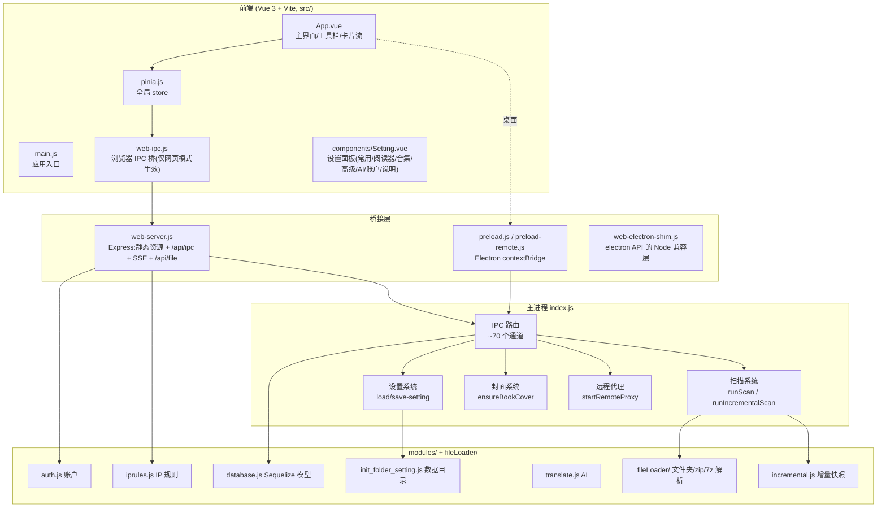

### 1.4 分层职责

| 层 | 文件 | 职责 | 运行环境 |
|---|---|---|---|
| 主进程 | `index.js`(约 3400 行) | 窗口/托盘/扫描/封面/设置/AI/远程代理/全部 IPC 实现 | Electron 或 Node |
| 网页服务 | `web-server.js` | HTTP 服务、鉴权、IPC 分发、SSE、文件读取 | 仅网页模式 |
| Node 兼容层 | `web-electron-shim.js` | 用纯 Node 模拟 `app`/`ipcMain`/`BrowserWindow`/`dialog` 等 | 仅网页模式 |
| 领域模块 | `modules/*.js` | 账户、IP 规则、数据库模型、数据目录、翻译、菜单 | 两者 |
| 文件解析 | `fileLoader/*.js` | 文件夹 / zip / rar-7z-cb7-cbr 三种漫画载体的枚举与解包 | 两者 |
| 前端 | `src/**` | 界面渲染与交互,只通过 IPC 通道与主进程通信 | 浏览器或 Electron |

### 1.5 关键设计取舍

| 设计 | 原因 |
|---|---|
| 前端不直接读文件,一律走 IPC | 浏览器无法访问文件系统;统一通道后桌面/网页共用一套界面 |
| 网页版用 HTTP 模拟 IPC 而非改造业务代码 | 主进程代码零改动即可跑在容器里,避免两套逻辑分叉 |
| 封面懒加载(浏览时才生成) | 建库扫描不再解压每本书;大库首扫从「小时级」降到「分钟级」 |
| 增量扫描用「目录 mtime 快照」 | `stat` 比 `readdir` 便宜一个数量级,秒级完成日常重扫 |
| 共享数据库里存 Windows 格式路径 | Windows 客户端与容器可同时读写同一份 `database.sqlite`,读时翻译 |
| 设置保存做「合并」而非「替换」 | 前端可能只提交部分键,替换会清空其余配置(v1.10.1 修复的事故) |

---

## 2. 启动流程

### 2.1 两个入口

| 入口 | 文件 | 做了什么 |
|---|---|---|
| 桌面版 | `package.json` 的 `main: index.js` | Electron 直接 `require("./index.js")`,拿到真 `electron` 模块 |
| 网页版 | `web.js` | 设 `WEB_MODE=1` → 把 `require("electron")` 的缓存替换为 `web-electron-shim.js` → 再 `require("./index.js")` |

`web.js` 的核心技巧(劫持模块缓存):

```js
process.env.WEB_MODE = "1"
const electronShim = require("./web-electron-shim.js")
const electronResolved = require.resolve("electron")
require.cache[electronResolved] = { id, filename, loaded: true, exports: electronShim }
require("./index.js")   // 此文件里的 require("electron") 拿到的是 shim
```

因此 `index.js` 顶部 `const { app, BrowserWindow, ipcMain, ... } = require("electron")` 无需任何条件判断即可双端运行。

`WEB_MODE` 常量(`index.js:34`)在后续被用来跳过窗口/托盘/局域网浏览等桌面专属逻辑。

### 2.2 数据目录定位决策树

这是**排障时最该先确认的一件事**,实现在 `modules/init_folder_setting.js`(桌面)与 `web-electron-shim.js`(网页)两处。

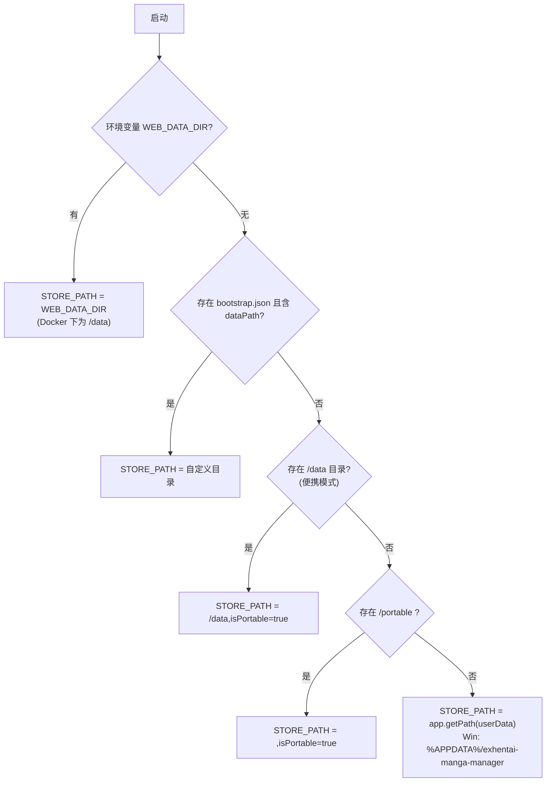

> ⚠️ **Dockerfile 里特意注释「绝对不能创建 /app/data 或 /app/portable」**,否则容器会误判为便携模式,把数据写到镜像层里,容器一重建数据就没了。
> 这是「设置/数据库消失」类问题的头号检查项。

网页版的用户目录来源在 `web-electron-shim.js` 里:优先 `WEB_DATA_DIR`,否则若 `%APPDATA%/exhentai-manga-manager/setting.json` 存在则复用桌面数据目录,再否则用 `<项目目录>/data`。

### 2.3 容器模式路径映射(WEB_LIBRARY)

`index.js:46-64` 在启动时做一次路径规整:**只对 Windows 盘符路径做映射**,容器内合法路径一律尊重。

```js
if (process.env.WEB_LIBRARY) {
  const forcedLibrary = path.resolve(process.env.WEB_LIBRARY)   // 例如 /library
  const lib = String(setting.library || "")
  if (/^[A-Za-z]:[\\/]/.test(lib)) {          // Y:\\01-漫画 → 容器路径
    if (!setting.externalLibraryRoot) setting.externalLibraryRoot = lib
    setting.library = forcedLibrary
  } else if (!lib || lib === "/") {
    setting.library = forcedLibrary
  }
  // metadataPath 同理:Windows 盘符 → 记 externalMetadataPath,内存置 null
}
```

同时记录三组「外部路径」,供跨平台互译使用:

| 字段 | 含义 |
|---|---|
| `externalLibraryRoot` / `windowsLibraryRoot` | 漫画库在 Windows 侧的根(如 `Y:\\01-漫画`) |
| `externalMetadataPath` | 元数据目录的 Windows 路径 |
| `externalCoverRoot` | 封面目录的 Windows 路径 |

### 2.4 数据库初始化与幂等迁移

`index.js:81-109` 是一个立即执行的 async IIFE,负责建表与补列:

1. `Manga.sync()` / `Metadata.sync()` 建表(新库);
2. **用原生 `ALTER TABLE ... ADD COLUMN` 幂等补列** —— 注释说明:Sequelize 在 SQLite 下的 `sync({alter:true})` 会走「备份表」策略,复制数据时引用旧表不存在的列而失败,所以新增列一律自己补;
3. `CREATE INDEX IF NOT EXISTS` 补建索引,加速 `filepath`/`hash` 精确查询与「文件查重」(`bundleSize + mtime`)。

当前需要补的列:

| 表 | 列 |
|---|---|
| `Mangas` | `hiddenBook`, `readCount`, `title_cn`, `description` |
| `Metadata` | `title_cn`, `description` |

### 2.5 日志与全局异常

`index.js:111-131` 把 `console.log/error` 重定向到双写(文件 + 标准输出):

- 日志文件:`<数据目录>/log.txt`,**以 `flags: "w"` 打开 —— 每次启动覆盖**,只保留本次运行日志;
- 网页版在容器里可通过 `docker logs` 或 `<数据目录>/log.txt` 查看;
- 另注册 `unhandledRejection`(仅打印)与 `uncaughtException`(**打印后 `process.exit(1)`**)。

## 3. 设置系统

设置是**整个项目最容易出问题、也最值得反复读**的部分。v1.10.1 修复的「设置反复丢失」事故就发生在这里。

### 3.1 三处默认值来源(踩坑点)

同一个 `setting.json` 的默认值散落在**三个地方**,它们并不完全一致,改设置项时必须三处同步思考:

| 来源 | 文件 | 作用 | 特点 |
|---|---|---|---|
| A. 桌面版默认值 | `modules/init_folder_setting.js` 的 `prepareSetting()` | 桌面端首次运行生成 `setting.json` | 字段最全(含 AI 相关新键) |
| B. 容器版默认值 | `docker/entrypoint.sh` 内联 heredoc | 容器首次运行生成 `setting.json` | 只含「当时的」字段,新键靠前端补 |
| C. 前端兜底默认值 | `src/components/Setting.vue` 的 `onMounted` | 打开设置页时对缺失键补默认值 | 面向旧配置文件向后兼容 |

三者的关系:

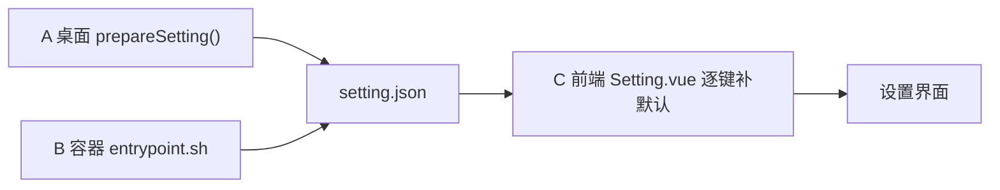

> **注意**:`entrypoint.sh` 只在 `setting.json` **不存在**时才写入。已存在时它完全不碰 —— 所以「容器重启后设置被重置」通常不是 entrypoint 干的,而是后续的保存链路把文件覆盖了。

### 3.2 读写与原子写入

所有落盘都走「临时文件 + rename」(`index.js` 的 `persistSetting()` 与 `applySetting()`):

```js
const targetPath = path.join(STORE_PATH, "setting.json")
const tempPath   = path.join(STORE_PATH, "setting.json.tmp")
fs.writeFileSync(tempPath, JSON.stringify(setting, null, "  "), "utf-8")
fs.renameSync(tempPath, targetPath)   // 同目录 rename 是原子的
```

同一策略也用于:`collectionList.json`、`scan-snapshot.json`(见 `incremental.js` 的 `saveSnapshotFile`)。

### 3.3 load-setting

```js
ipcMain.handle("load-setting", async (event, arg) => setting)   // 返回内存中的整个对象
```

要点:

- 返回的是**内存对象引用**(桌面 IPC 会被结构化克隆;网页版会被 JSON 序列化);
- 网页版在 `web-server.js` 里对 viewer(只读账户)**脱敏**:剔除 `igneous`/`ipb_pass_hash`/`ipb_member_id`/`star`/`proxy`/`openaiApiKey`/`titleTranslationApiKey`;
- 远程桌面模式不走这个 handler,而是由本地代理转发到 NAS(见第 7 章)。

### 3.4 save-setting / applySetting(v1.10.1 核心修复)

#### 修复后的完整逻辑(`index.js:2076` 起)

```js
const applySetting = async (receiveSetting) => {
  // ① 合并:前端没传的键保留内存中的原值(修复「整份替换」)
  receiveSetting = { ...setting, ...(receiveSetting || {}) }

  // ② 副作用:代理 / 元数据库切换 / 局域网浏览 / 开机启动 / 置顶 / 快捷键
  if (receiveSetting.proxy) await session.defaultSession.setProxy({...})
  if (receiveSetting.metadataPath !== setting.metadataPath) { /* 切换 Metadata 模型 */ }
  // ... 其余即时生效逻辑

  // ③ 容器路径映射:内存用容器路径,落盘写 Windows 侧
  let fileSetting = { ...receiveSetting }
  if (process.env.WEB_LIBRARY) { /* 见 3.5 */ }

  // ④ 内存替换为「合并后」的完整对象(而不是前端传来的局部对象)
  setting = receiveSetting

  // ⑤ 原子落盘
  await fs.promises.writeFile(tempPath, JSON.stringify(fileSetting, null, "  "), "utf-8")
  return await fs.promises.rename(tempPath, targetPath)
}
```

#### 为什么必须合并

前端的保存请求**不保证包含全部设置键**,典型场景:

1. 应用程序启动时,前端还没加载完设置就提交了一次「局部保存」;
2. 某些组件只回传自己关心的键;
3. 远程模式下客户端专属键会被拆出来单独保存。

因此后端不能假设「收到的对象 = 完整配置」。**合并是唯一安全的默认语义**。

#### 五个关键点(改这段代码前必读)

| 点 | 说明 |
|---|---|
| 合并发生在**最前面** | 保证后面所有 `receiveSetting.xxx !== setting.xxx` 的比较语义正确(没传的键两边相等 → 不触发副作用) |
| `setting = receiveSetting` | 此时 `receiveSetting` 已经是合并结果,不是前端原样对象 |
| 落盘用 `fileSetting` | 容器模式下它与内存 `setting` 可能不同(内存用容器路径,磁盘存 Windows 路径) |
| 不能删除键 | 合并语义意味着「前端没传」= 保留;要清空某个键必须显式传 `null` |
| 即时生效逻辑要看合并后的值 | 例如 `metadataPath` 的比较,否则局部保存会误触发元数据库切换 |

### 3.5 容器路径映射(applySetting 内)

```
输入 receiveSetting.library:
├─ Windows 盘符(Y:\\...)  → 内存 library = /library
│                            磁盘 library = externalLibraryRoot(Windows 路径)
│                            并写入 windowsLibraryRoot 兼容字段
├─ 空 或 "/"               → 内存 & 磁盘 library = forcedLibrary(/library)
└─ 其他 Linux 路径(/library/sub) → 原样保留(尊重用户设置)

metadataPath 同理:Windows 盘符 → 磁盘存 externalMetadataPath,内存置 null(回退默认数据目录)
```

这段曾经写错过一次:**Linux 分支里用局部对象重建了 `fileSetting`,把刚做的合并又丢掉了**,导致容器内「库/元数据目录被重置」。v1.10.1 已修正为基于合并对象派生。

### 3.6 前端设置生命周期

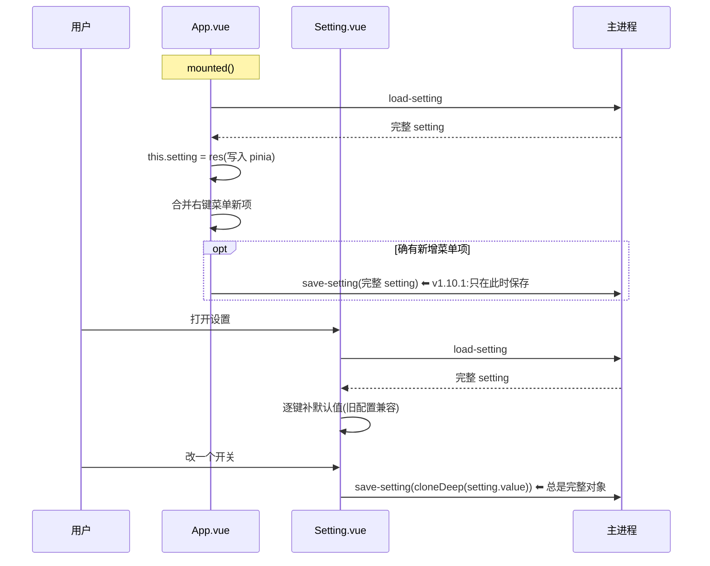

要点:

- 设置的**唯一真源**是 pinia store 的 `setting`(`src/pinia.js` 初始为 `{}`);
- `save-setting` 由 `Setting.vue` 的 `_.debounce(..., 500)` 防抖,少数开关用「立即保存」绕过防抖;
- 设置变更后还要调用 `applyAppName/applyCoverStyle/applyCustomTheme/applyFavicon` 等把值作用到 DOM;
- **v1.10.1 起,任何保存都必须发生在 `load-setting` 之后**,并且携带完整对象。

### 3.7 事故复盘:「设置反复丢失」

#### 现象

- 每次打开网页 / 重启容器,设置项陆续变回默认值;
- `setting.json` 被清成只剩两个键:`{"contextMenuOptions": {...}, "library": "/library"}`;
- 数据目录里出现 `setting.json.broken-YYYYMMDD` 之类的残留文件。

#### 完整链路(两处缺陷叠加)

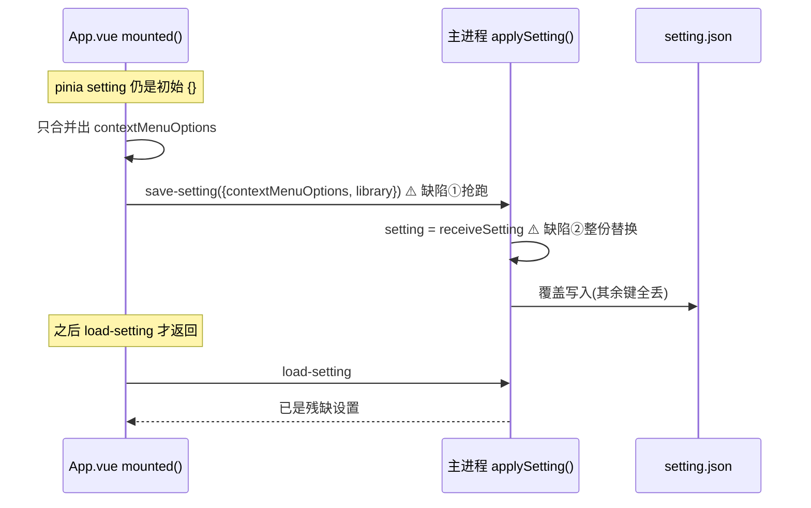

| 缺陷 | 位置 | 后果 |
|---|---|---|
| ① 前端抢跑 | `src/App.vue` `mounted()`(v1.9.8 引入) | 在 `load-setting` 之前就提交了一个只含 `contextMenuOptions` 的对象 |
| ② 后端整份替换 | `index.js` `applySetting()` | 把这份局部对象当成完整配置落盘 |

#### 修复对照

| 层 | 旧 | 新(v1.10.1) |
|---|---|---|
| 后端 | `setting = receiveSetting`;`fileSetting = receiveSetting` | 开头 `receiveSetting = { ...setting, ...receiveSetting }`;落盘用合并结果 |
| 前端 | `mounted()` 里立即 `save-setting` | 移到 `load-setting` 的 `.then()` 中,且仅当「确有新增右键菜单项」才保存 |

#### 判据(以后再次出现时怎么确认)

1. 看 `setting.json` 大小:正常几 KB,被清空后只剩几百字节;
2. 看是否只剩 `contextMenuOptions` + `library` 两个键 —— 这是**该缺陷的指纹**;
3. 数据目录里找 `_recover_backup_*/BASE_setting.json` 或 `setting.json.broken-*` 恢复。

---

### 3.8 右键菜单项的版本迁移(v1.10.2 修复)

`setting.contextMenuOptions` 的结构是「每个菜单 → 已勾选的菜单项 id 数组」:

```json
{ "title": ["copyTitle","copyLink"], "cover": ["getMetadata","deleteFile"], "image": ["copyImage"], "comment": ["openLink"] }
```

#### 要同时满足的两个需求

| 需求 | 说明 |
|---|---|
| 版本升级后新菜单项自动出现 | 例如新增「全本上色」后,老用户升级应能看到并勾上 |
| 用户取消的勾选必须保留 | 用户主动去掉的项不能被任何加载逻辑加回来 |

两者冲突时,判据只能是「这个项**以前是否出现过**」。

#### 错误实现(v1.10.1 及以前)

```js
for (const [menu, items] of Object.entries(contextMenuDefinitions)) {
  const saved = options[menu] || []
  options[menu] = [...new Set([...saved, ...items])]   // items = 当前定义的全部项
}
```

`items` 是当前版本的**全量**定义,无条件并回已保存值 ⇒ 用户取消的项每次加载都被重新勾上。
而 `App.vue` 在启动时执行同一段逻辑,并因「值变了」触发 `save-setting`,把这份全选结果**写回服务器持久化**。

#### 正确实现(`mergeContextMenuOptions`,src/utils.js)

用 localStorage 记录「上一次界面定义过的项 id」(`emmContextMenuKnown`):

```
无记录(首次运行 / 清了浏览器数据) → 完全信任已保存值,不做任何并入
有记录                            → 只并入 (当前定义 − 上次定义),即真正的版本新增项
某分组为 undefined(旧配置)        → 用默认全量
每次合并后,把「当前定义全量」写回 localStorage
```

| 设计点 | 原因 |
|---|---|
| 记录存 localStorage 而非 setting.json | 「已知项」跟随**界面代码版本**,而远程模式下客户端与 NAS 网页版可能不是同一版本;分开记录才不会互相污染 |
| 记录丢失也安全 | 丢失后退化为「完全信任已保存值」,最坏情况只是新菜单项不自动出现,绝不会覆盖用户选择 |
| 返回值带 `changed` | 只有真正发生变化才触发保存,避免每次启动都写一次服务器 |

调用点:`App.vue`(启动加载设置后)与 `components/Setting.vue`(打开设置页时)。

---

## 4. 账户与会话

实现文件:`modules/auth.js`(账户与会话)+ `web-server.js`(HTTP 层鉴权)。**仅网页版生效**,桌面版没有账户概念。

### 4.1 数据结构

| 文件 | 位置 | 结构 |
|---|---|---|
| `users.json` | 数据目录 | `{ "users": { "universc": { salt, hash, role, createdAt } } }` |
| `sessions.json` | 数据目录 | `{ "<token>": { username, role, expires } }` |

`role` 只有两个值:`admin`(全部功能)/ `viewer`(只读)。

### 4.2 启用与首次初始化

`loadUsers(dataDir)` 的流程:

```js
if (users.json 里一个用户都没有) {
  if (process.env.WEB_ADMIN_PASSWORD)  → 用 WEB_ADMIN_USER(默认 admin)创建管理员
  else                                 → 打印「账户系统未启用」,保持匿名访问
}
authEnabled = (用户数 > 0)
```

> 也就是说:**不配置 `WEB_ADMIN_PASSWORD` 就完全不鉴权**(与 1.6.x 行为一致)。此时 v1.10.1 新增的路由鉴权中间件会自动放行。

### 4.3 密码存储

```js
salt = crypto.randomBytes(16).toString("hex")
hash = crypto.scryptSync(password, salt, 32).toString("hex")   // scrypt + 每用户独立盐
```

- 校验用**字符串相等**比较(非 timing-safe,但内网场景可接受);
- 密码最短 4 位(`validPassword`);
- **管理员账户不能被删除**(`removeUser` 拒绝);
- 任何地方都不存明文密码 —— 环境变量只在首次创建时使用。

### 4.4 会话

| 项 | 值 |
|---|---|
| token | `crypto.randomBytes(32).toString("hex")` |
| Cookie 名 | `emm_token` |
| Cookie 属性 | `HttpOnly; Path=/; Max-Age=604800; SameSite=Lax`(7 天) |
| 存储 | 内存 Map + `sessions.json` 持久化(容器重启后免登录) |
| 清理 | 每次读取时惰性剔除过期项;登录/登出时立即持久化 |

`SameSite=Lax` 意味着图片等**同源请求会自动携带 Cookie**,这也是新增 `/api/file` 鉴权后浏览器仍能正常显示封面的原因。

### 4.5 登录流程与限流

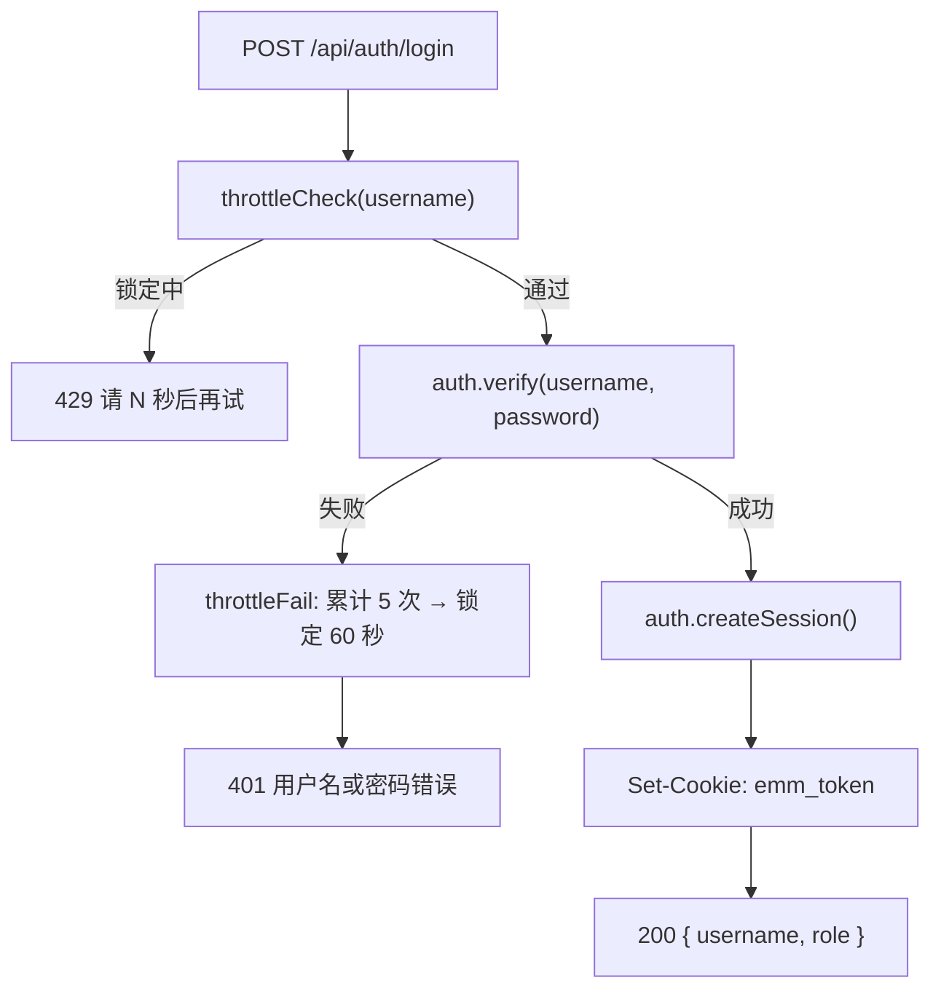

限流表 `loginThrottle` 是**内存 Map,按用户名计**,重启即清空(不考虑分布式场景)。

### 4.6 请求鉴权矩阵(v1.10.1 重点)

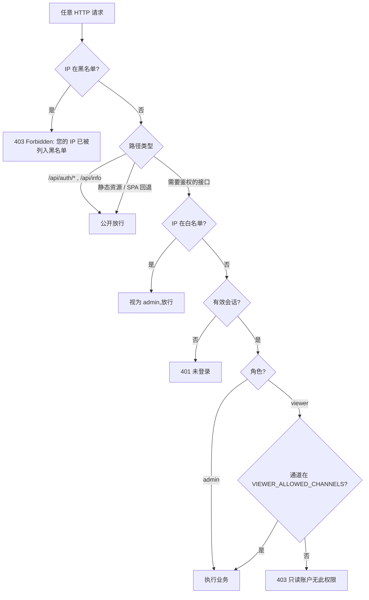

#### 需要登录的接口清单

| 接口 | 用途 | 鉴权方式 | 生效版本 |
|---|---|---|---|
| `POST /api/ipc/:channel` | 所有功能调用 | 未登录 401;viewer 走白名单,写操作 403 | 1.8.x 起 |
| `GET /api/events` | SSE 事件流 | 未登录 401;viewer 过滤管理类消息 | 1.8.x 起 |
| `GET /api/file` | 封面 / 阅读图片 | **未登录 401** | **1.10.1 新增** |
| `GET /api/list-dir` | 目录列表(网页版文件选择器) | **未登录 401** | **1.10.1 新增** |
| `GET /browse` | 目录浏览页 | **未登录 401** | **1.10.1 新增** |

#### 公开接口

| 接口 | 为什么公开 |
|---|---|
| `GET /api/info` | 前端启动时必须先知道「是否启用账户 / 当前角色 / 版本 / pathSep」,还没登录也要能拿 |
| `GET/POST /api/auth/*` | 登录、登出、查询当前用户 —— 不公开就无法登录 |
| `express.static(DIST_DIR)` | 登录页面本身是静态资源 |

#### 统一中间件实现

```js
const requireLogin = (req, res, next) => {
  if (auth.isEnabled() && !sessionOf(req)) {
    return res.status(401).send("Unauthorized: 请先登录后再访问")
  }
  next()
}
// 挂载:app.get("/api/file", requireLogin, handler) 等三处
```

`sessionOf(req)` 内部已经把「IP 白名单」短路成 `{ username: "whitelist", role: "admin" }`,所以白名单用户不会被拦。

### 4.7 权限模型(viewer 只读账户)

两层防护:

| 层 | 实现 | 说明 |
|---|---|---|
| 前端 | 组件里的 `viewerRole` 判断 | 隐藏写操作入口(扫描/编辑/删除/AI 等)。只是体验,不是安全边界 |
| 服务端 | `VIEWER_ALLOWED_CHANNELS` 白名单 | **默认拒绝**:不在白名单的通道一律 403。安全边界在此 |

白名单内容(均为只读/阅读类):`load-setting`、`load-book-list`、`get-folder-tree`、`load-collection-list`、`load-manga-image-list`、`get-locale`、`get-path-sep`、`extract-image-text`、`ai-translate-text` 等。

额外规则:

- `load-book-list(scan=true)` 即使 viewer 在白名单内也会被拒(它会触发建库,属写操作);
- `load-setting` 对 viewer **返回脱敏副本**(敏感键替换为空);
- SSE 广播时,`send-message` / `send-action` 不推给 viewer 连接。

> 新增写操作 IPC 时**不要**把它加进白名单;新增只读通道时才加。

### 4.8 IP 访问控制

`modules/iprules.js`,数据文件 `<数据目录>/iprules.json`:

```json
{ "whitelist": ["192.168.1.10", "192.168.1.0/24"], "blacklist": [] }
```

| 规则 | 效果 |
|---|---|
| 黑名单命中 | 全站 403(全局中间件,页面都打不开) |
| 白名单命中 | **免登录**,视为 `admin` |
| 都不命中 | 正常登录流程 |

实现细节:

- IP 提取:`String(req.ip || req.socket.remoteAddress).replace(/^::ffff:/, "")`(剥离 IPv6 映射前缀);
- 匹配:`ipToInt()` 把点分十进制转 32 位整数,CIDR 用掩码比较;支持单 IP 与 `/0`~`/32`;
- 保存时 `setRules()` 会**校验并剔除非法条目**,再用 `Set` 去重;
- 管理入口:设置 → 账户 → IP 访问控制(**仅 admin 可达**)。

---

## 5. 文件与图片服务

实现:`web-server.js`。这是浏览器唯一能「直接读 NAS 文件」的通道,**必须严格限制可读范围**。

### 5.1 /api/file

```js
const allowedRoots = () => {
  const setting = getSetting() || {}
  return [STORE_PATH, setting.library, setting.metadataPath].filter(Boolean).map(p => path.resolve(p))
}
```

请求 `GET /api/file?path=<绝对路径>` 的处理:

1. `requireLogin` 鉴权(1.10.1 新增);
2. 去掉前端可能附加的 `?id=` 缓存参数;
3. `path.resolve` 后做**前缀白名单校验**:必须是 `STORE_PATH` / `library` / `metadataPath` 之一,或它们的子路径(`p === root || p.startsWith(root + path.sep)`);
4. 不存在或不是文件 → 404;
5. `res.sendFile` 发送。

`getSetting` 由 `index.js` 在启动 `web-server` 时注入(`start({ getSetting: () => setting })`),**读的是实时内存设置** —— 用户改了漫画库路径后立即生效。

### 5.2 缓存策略

```js
const isCover = p.startsWith(path.join(STORE_PATH, "cover") + path.sep)
res.sendFile(p, { headers: isCover
  ? { "Cache-Control": "public, max-age=86400" }   // 封面:文件名稳定,长缓存 1 天
  : { "Cache-Control": "no-store" }                 // 阅读图片:临时文件,禁止缓存
})
```

设计理由:封面按漫画名命名且路径稳定,长缓存能显著减少滚动时的请求;而阅读用图片是从压缩包解到 `viewer/` 的临时文件,**文件名可能复用**,必须禁缓存否则会串图。

### 5.3 /browse 目录浏览页

「打开所在目录」在网页版不弹系统文件管理器,而是**新开标签页渲染一个服务端生成的 HTML 目录列表**:

- `requireLogin` 鉴权(1.10.1 起);
- 目标路径同样做 `allowedRoots` 前缀校验(只能浏览漫画库/数据目录内);
- 面包屑、文件夹在上文件在下、文件用 `/api/file?path=` 打开;
- 排序用 `localeCompare(..., "zh")`,文件用 `{ numeric: true }` 让 `2.jpg < 10.jpg`。

远程桌面模式下这个路由也会被本地代理转发(见 7.3)。

### 5.4 前端路径改写(web-ipc.js)

浏览器不能直接加载 `D:\xxx\cover.webp`,所以桥接层做**双向改写**:

```
服务端 → 前端:coverPath / thumbnailPath / filepath 若是本地路径
             → "/api/file?path=" + encodeURIComponent(路径)
前端 → 服务端:/api/file?path=... 还原为本地路径再发给主进程
```

判定「本地路径」的条件(`isLocalPath`):不以 `http://`/`https://`/`data:`/`blob:`/`/api/file?path=` 开头,
且以 `/` 开头、或 `X:` 盘符、或 `\\\\` UNC 开头。

注意:只有**白名单键名**(`coverPath`、`thumbnailPath`,以及阅读事件额外加入的 `filepath`)才会被改写,避免把普通字符串误改成 URL。

## 6. IPC 与事件

### 6.1 桌面版

`preload.js` 通过 `contextBridge` 暴露:`window.ipcRenderer.invoke/on`、`window.electronFunction`。
主进程用 `ipcMain.handle(channel, fn)` 注册,前端 `invoke(channel, ...args)` 拿到 Promise 结果。

### 6.2 网页版 IPC 桥

`web-ipc.js` 在 `!window.ipcRenderer` 时安装一份**同名 API**:

| 前端 API | 网页版实现 |
|---|---|
| `invoke(channel, ...args)` | `POST /api/ipc/:channel`,body `{ args }` |
| `on(channel, fn)` | 订阅 SSE 事件分发 |
| `sendSync("get-path-sep")` | 返回启动时同步拿到的 `pathSep` |

服务端 `web-server.js` 的 `/api/ipc/:channel`:

```js
const handler = ipcMain._handlers.get(channel)      // 来自 web-electron-shim 的注册表
const result = await handler(fakeEvent, ...args)    // fakeEvent.sender.send === SSE 广播
res.json({ ok: true, result })
```

`web-electron-shim.js` 用两个 Map(`_handlers` / `_onHandlers`)收集 `ipcMain.handle/on` 的注册,
并让 `BrowserWindow` 变成空壳 —— 于是 `index.js` 里与窗口相关的代码在容器中「执行但不生效」。

### 6.3 SSE 事件流

**服务端**(`web-server.js`)

```js
const broadcast = (channel, arg) => {
  const payload = `data: ${JSON.stringify({ channel, arg })}\n\n`
  for (const res of sseClients) {
    if (isAdminOnly && res._emmViewer) continue   // viewer 不接收管理类消息
    res.write(payload)
  }
}
setBroadcast(broadcast)   // 注入给 electron shim,index.js 的 broadcast 即走这里
```

要点:

- 每 25 秒发一次 `: ping` 心跳,避免代理/浏览器掐断空闲连接;**心跳定时器 `.unref()`**,不阻止进程退出;
- 连接建立时记录该连接的角色(`res._emmViewer`),用于广播过滤;
- `send-message` / `send-action` 属于管理类通道,viewer 收不到;`manga-image` 等阅读类会正常推送。

**前端**:`new EventSource("/api/events")`,`onmessage` 里按 `data.channel` 分发到 `listeners` Map。

### 6.4 通道与消息分类

主进程消息(通过 `sendMessageToWebContents` 双端发送):

| 消息 | 含义 | 前端动作 |
|---|---|---|
`开始加载漫画库` | 扫描开始 | 显示扫描中状态 |
`从漫画库找到 N 本漫画` | 枚举完成 | 记录日志 |
`加载 xxx 失败:...` | 单本处理失败 | 记录 |
`Scan complete` | 扫描结束 | 重新加载列表 |
`扫描结果异常:...` | 安全阀触发 | 告警 |
`清理了 N 本不存在的漫画` | 清理完成 | 日志 |

`send-action` 类型的结构化事件:

| action | 载荷 | 用途 |
|---|---|---|
`send-progress` | `{ progress }` | 进度条(`-1` 表示隐藏) |
`scan-batch` | — | 「边扫边显示」:本批已入库,前端节流刷新列表 |

完整 IPC 通道列表见 [13.2](#132-ipc-通道全表)。

---

## 7. 远程桌面模式

### 7.1 动机

Windows 客户端填了 NAS 地址后,希望:

1. 用**客户端自己的最新界面**(而不是 NAS 上可能过期的网页);
2. 数据(库/图片/事件)全部来自 NAS;
3. 自动登录,不用每次输密码;
4. 窗口/托盘/快捷键等桌面设置保存在**本机**。

于是客户端在主进程里起了一个**只监听 `127.0.0.1` 的本地代理**(`startRemoteProxy`, `index.js:289`),
窗口加载 `http://127.0.0.1:23886/`(本地 dist),所有请求由代理转发到 NAS。

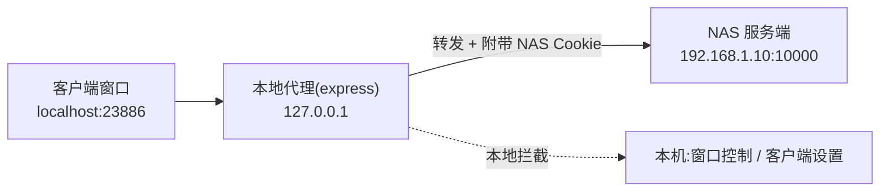

### 7.2 端口固定

```js
const PROXY_BASE_PORT = 23886
// 端口被占用则 23886, 23887, ... 最多试 20 个
```

注释里写明了原因:**前端 localStorage 按 origin(含端口)隔离**,随机端口会导致「阅读器模式/排序/阅读进度」这类存在 localStorage 的偏好每次重启丢失。

### 7.3 路由拦截表

| 路由 | 行为 |
|---|---|
| `POST /api/ipc/load-setting` | **本地 + 远端合并**(见 7.5) |
| `POST /api/ipc/save-setting` | 拆分:客户端键存本机,其余转发 NAS |
| `POST /api/ipc/update-window-title` | 本地设置窗口标题 |
| `POST /api/ipc/open-url` | 本地 `shell.openExternal` |
| `window-minimize` / `window-toggle-maximize` / `get-window-state` | 本地窗口控制 |
| `window-set-always-on-top` / `window-toggle-always-on-top` | 本地置顶并落盘 |
| `get-data-path` / `set-data-path` | 本地数据目录 |
| `open-library-folder` / `relaunch-app` / `switch-to-local-mode` | 本地桌面功能 |
| `test-remote-server` | 直接返回本版本信息(代理本身即证明连通) |
| `enable-LAN-browsing` | 远程模式无需局域网浏览,返回 false |
| **其余全部** | 转发到 `NAS/api/ipc/:channel`,带 NAS Cookie;401 时清除本地会话 |

非 IPC 路由:

| 路由 | 行为 |
|---|---|
| `GET /api/file` | 流式转发到 NAS(图片) |
| `GET /browse` | 转发 NAS 的目录浏览 HTML |
| `GET /api/events` | 转发 SSE(双向管道 + 关闭清理) |
| `POST /api/auth/login` `/logout` | 转发并在成功时缓存 `set-cookie` |
| `GET /api/auth/me` | 转发 |
| `GET /api/info` | 转发并**注入 `remoteDesktop: true`**;NAS 不可达时返回兜底信息(含 `proxyError`) |
| 静态资源 | 直接读本地 `dist/` |

> ⚠️ **新增「需要本地处理」的 IPC 通道时,必须在这里加拦截分支**,否则会被转发到 NAS 而 404(NAS 是纯 Node,没有那些桌面通道)。

### 7.4 会话持久化与自动登录

```
nasSessionFile = <数据目录>/nas-session.json   { cookie, savedAt }
```

启动代理时 `autoLogin()`:

1. 读本地缓存的 Cookie;
2. 调 `NAS/api/auth/me` 验证是否仍有效(有效则直接复用,不必输密码);
3. 失效则用 `setting.webUsername` / `setting.webPassword` 重新登录,成功后缓存新 Cookie;
4. 之后所有转发请求都带上这个 Cookie。

### 7.5 设置的拆分保存

客户端专属键(`CLIENT_SETTING_KEYS`,存在本机):

```
remoteServer, webUsername, webPassword,
startOnLogin, alwaysOnTop, globalHotkey,
minimizeOnStart, minimizeToTray, closeToTray
```

另外在 `load-setting` 时,代理会把 NAS 返回的设置缓存到 `nasSettingCache`,
并在 `save-setting` 转发前用它补全 `metadataPath`(NAS 端要用它判断是否切换元数据库)。

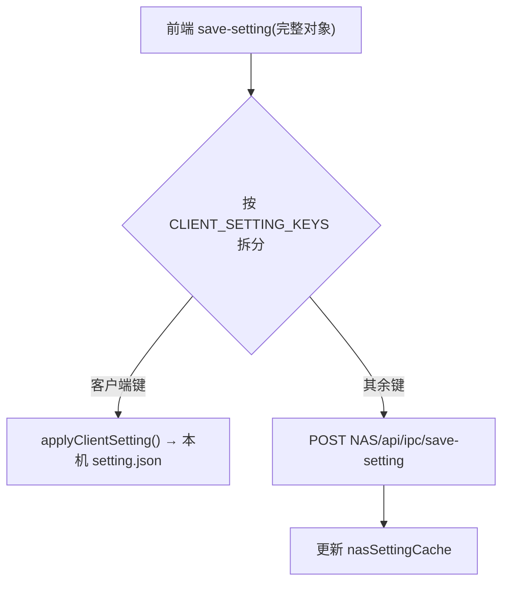

> 正因为前端会传**完整对象**,而客户端前缀又是从 NAS 加载后合并的,所以拆分的两侧都是完整的。
> 但如果前端在某处只提交了局部对象,`applyClientSetting` 的 `Object.assign` 与 NAS 端的合并逻辑就都会成为安全网。

## 8. 漫画库

### 8.1 数据模型(`modules/database.js`)

两张 SQLite 表(两个 Sequelize 实例,可指向不同文件):

**Mangas**(`<数据目录>/database.sqlite` 或 `setting.library` 下的共享库):

| 字段 | 类型 | 说明 |
|---|---|---|
| `id` | TEXT PK | `nanoid()` |
| `filepath` | TEXT | 漫画载体路径(落盘统一为 Windows 格式) |
| `type` | TEXT | `folder` / `zip` / `archive` |
| `hash` | TEXT | 目标页(第 8 页或首页)原图字节的 sha1 |
| `coverPath` | TEXT | 封面文件路径 |
| `coverHash` | TEXT | 封面图 sha1 |
| `bundleSize` / `mtime` | INTEGER / TEXT | 文件大小与修改时间,用于「搬家检测」 |
| `pageCount` / `filecount` / `filesize` | INTEGER | 页数与体积 |
| `tags` | JSON | `{ artist: [...], parody: [...], character: [...], ... }` |
| `title` / `title_jpn` / `title_cn` | TEXT | 英文 / 日文 / AI 中文标题 |
| `description` | TEXT | 故事简介 |
| `status` | TEXT | `non-tag`(未打标) / `tagged` / `tag-failed` |
| `category` / `rating` / `posted` / `url` | — | ExHentai 元数据 |
| `mark` / `hiddenBook` / `readCount` / `exist` | — | 收藏 / 隐藏 / 阅读次数 / 本次扫描是否存在 |

**Metadata**(`metadata.sqlite`,可放在独立目录用于跨设备共享打标结果):主键是 `hash`,存放标签/评分/标题等可移植信息。

索引(新库自动建,老库启动时补):`filepath`、`hash`、`(bundleSize, mtime)`。

### 8.2 三类漫画载体

| type | 判定 | 枚举实现 | 读图实现 |
|---|---|---|---|
| `folder` | 目录直接含图片 | 目录 BFS | 直接读文件 |
| `zip` | `.zip` / `.cbz` | glob | 优先 adm-zip 内存解压,失败回退 7z |
| `archive` | `.rar` / `.7z` / `.cb7` / `.cbr` | glob | 7z 解压 |

7z 可执行文件的选择(`fileLoader/archive.js` 顶部):

```js
const _7z = process.platform === "win32"
  ? path.join(getRootPath(), "resources/extraResources/7z.exe")   // 桌面版随附
  : "7z"                                                          // Docker 镜像内置 p7zip-full
```

两个易踩的兼容点:

1. **输出行尾**:Windows 7z 输出 `\r\n`,Linux 输出 `\n`。解析用 `split(/\r?\n/)` 才能双平台通用;
2. **默认密码**:ExHentai 下载件常见 `-p123456`,命令统一带上(无密码包不受影响)。

### 8.3 全量扫描(`runScan`)

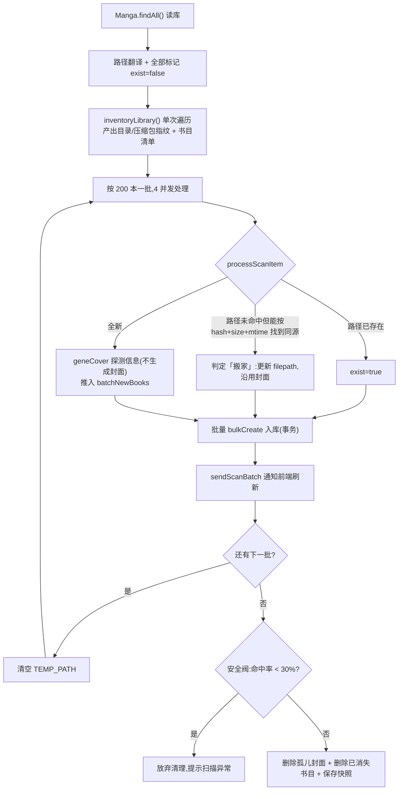

#### 性能设计

| 设计 | 效果 |
|---|---|
| `inventoryLibrary` 单次遍历同时产出书目与指纹 | 取代原来「文件夹 BFS + rar glob + zip glob」三趟遍历 |
| 并发 4 + 每批 200 | 兼顾解压 IO 与内存;每批之间清 `TEMP_PATH` |
| 封面懒加载(`geneCover(..., null)`) | 扫描只 `7z l` 列目录,不解压整包 |
| 批量 `bulkCreate` 事务 | 避免逐条 fsync |
| 每批 `sendScanBatch` | 「边扫边显示」,不等整轮结束 |
| `waitViewerIdle()` | 用户正在阅读时扫描暂停,把 IO 让给阅读器 |

#### 两个安全阀(防误删)

1. **全量**:`existData.length / bookList.length < 0.3` → 判定漫画库掉线,**跳过清理**(否则 NAS 挂载异常会把整个库的记录和封面删掉);
2. **增量**:`removedDirsCount / totalDirsCount > 0.8` 且总目录数 > 50 → 同样跳过清理并保留原快照。

#### 「搬家检测」

文件被移动/重命名后,不能只按路径判新书。`findSameFile()`(`fileLoader/folder.js`)按 `bundleSize + mtime + 类型` 在库里找**唯一匹配**;
命中则视为同一本:更新 `filepath`、把 `exist` 置回 `true`、沿用原封面,**不重新生成封面、不丢标签**。

### 8.4 增量扫描(`runIncrementalScan` + `fileLoader/incremental.js`)

#### 快照结构(`scan-snapshot.json`)

```json
{
  "v": 1,
  "library": "/library",
  "excludeFile": "",
  "time": "2026-09-30T02:51:00.000Z",
  "dirs": { "/library/2/[作者] 标题": { "m": 1785054715742.12, "img": 1 } },
  "arch": { "/library/x.zip": { "m": 1726427813172.25, "s": 10485760 } }
}
```

| 字段 | 含义 |
|---|---|
| `dirs[path].m` | 目录 mtime(毫秒) |
| `dirs[path].img` | 该目录是否**直接**包含图片(即它本身是一本「文件夹漫画」) |
| `arch[path].m` / `.s` | 压缩包 mtime / size |

#### 差异算法(`diffInventory`)三阶段

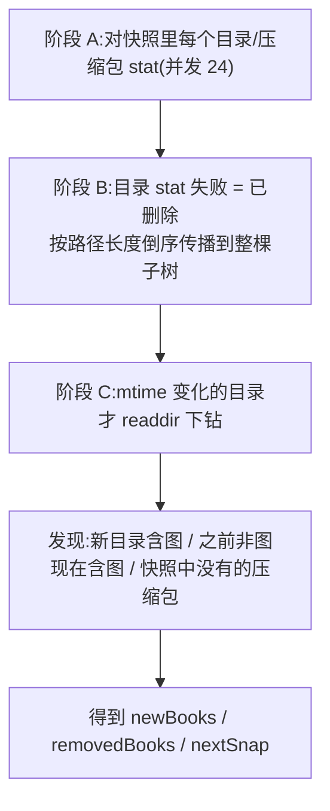

关键点:

| 点 | 说明 |
|---|---|
| `stat` 代替 `readdir` | 对没变的目录,只做一次 `stat`,比 `readdir` 便宜一个数量级 |
| `MTIME_TOLERANCE = 1`(ms) | 只用于消除浮点噪声。注释特别说明**不能设大**:目录 mtime 刷新有延迟/粒度粗,容差大了会漏判刚发生的变更 |
| 压缩包单独按文件 stat | **同名覆盖下载**(目录 mtime 不变)也能被发现 |
| 目录消失 → 子树整体消失 | 避免对已删除子树逐层 stat |
| BFS 下钻 | 先处理变化目录,再处理它新出现的子目录 |
| 无变化不写快照 | 快照文件可能 1MB+,没必要每轮重写 |

#### 回退策略

`runIncrementalScan` 开头检查:

```js
if (!oldSnap || oldSnap.library !== setting.library || oldSnap.excludeFile !== (setting.excludeFile || "")) {
  sendMessageToWebContents("增量扫描:无有效快照(库路径或排除规则变化),转为全量扫描")
  await runScan()      // 全量扫描结束会重建快照
  return
}
```

另外增量扫描有一个 `force-gene-book-list` 之外的兜底:快照里有记录、但数据库缺的书,会被当作候选重新探测(补上次探测失败的书)。

### 8.5 封面懒加载

项目早期版本「扫描时给每本书生成封面」,大库首扫极慢。现在的做法(`ensureBookCover`,`index.js:1000`):

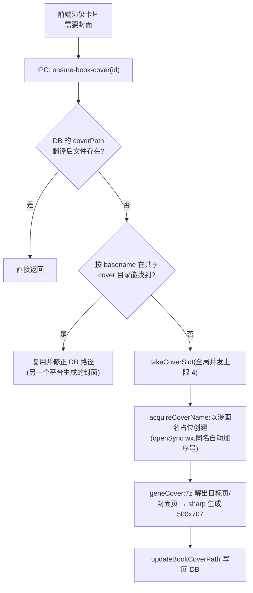

几个细节:

| 细节 | 说明 |
|---|---|
| 并发限制 4 | `takeCoverSlot/releaseCoverSlot` + 等待队列,解压+sharp 很吃磁盘/CPU |
| 每本书一把锁 | `coverJobs` Map:并发的重复请求只生成一次 |
| 封面以漫画名命名 | `sanitizeFileName()` 清洗 Windows 非法字符/控制字符/结尾点空格/保留名(CON 等),限长 180 |
| 占位文件技巧 | `openSync(path, "wx")` 独占创建,同名时 `EEXIST` 就试 `名字 (2).webp`;sharp 成功输出会覆盖占位文件,失败则 `releaseCoverName` 删掉 |
| 裁剪方式 | `resize(500, 707, { fit: "cover" })` 居中裁切;注释说明用 `contain` 会给横图留黑边,在「填充封面」布局里很难看 |
| 封面 hash | ≤8 页的书「目标页 == 封面页」时复用同一次 sha1,避免同文件读两遍 |

### 8.6 跨平台路径互译

NAS 与 Windows 可能**同时读写同一份 `database.sqlite`**,而两边的路径格式不同。

| 方向 | 函数 | 规则 |
|---|---|---|
| 读(外部 → 本机) | `translateBookPath(p, kind)` | `filepath`:若以 `externalLibraryRoot` 开头,替换为 `setting.library` + 相对路径;`coverPath`:任意绝对路径(盘符/UNC/Linux)一律**取 basename** 映射到本机 `COVER_PATH` |
| 写(本机 → 外部) | `toExternalPath(p, kind)` | `filepath`:`setting.library` 前缀替换为 `externalLibraryRoot`(反斜杠);`coverPath`:`COVER_PATH` 前缀替换为 `externalCoverRoot` |

配套约定:

- 共享库里 `Mangas.coverPath` **一律写成 Windows 格式**;
- 所有封面文件都放在共享的 `COVER_PATH` 目录里(文件名唯一),所以「取 basename」是安全的;
- 清理孤儿封面时也**按 basename 比对**,避免删除另一平台引用的封面。

### 8.7 元数据合并与「库重建」

| 操作 | 通道 | 行为 |
|---|---|---|
| 加载列表 | `load-book-list` | 读 `Mangas`,与 `Metadata` 按 `hash` 合并(用 `Map` 索引,替代 O(n²));`status` 是 `non-tag` 而元数据有标签时回写 |
| 全量重扫 | `load-book-list(true)` | 后台 `runScan()`,立即返回当前列表不阻塞 UI |
| 强制重建 | `force-gene-book-list` | `Manga.destroy({truncate:true})` + 清空 TEMP/COVER,再全量扫描(**会丢封面文件**) |
| 单本保存 | `save-book` | 写 `Mangas` 与 `Metadata`(路径转外部格式) |
| 导入导出 | `export-database` / `import-database` | 复制 `collectionList.json` + `metadata.sqlite`(导入后桌面版自动重启) |

## 9. 前端实现

### 9.1 启动与状态

`src/main.js` 做四件事:导入 `web-ipc.js`(网页桥,Electron 下自动跳过)→ 装 Pinia/ElementPlus/ContextMenu/i18n → 注册全局 `v-lazy` 指令 → `app.mount("#app")`。

全局状态在 `src/pinia.js` 的 `useAppStore` 中,关键 state:

| state | 说明 |
|---|---|
| `setting` | 全部设置(**初始为 `{}`**,由 `load-setting` 填充) |
| `bookList` / `displayBookList` / `chunkDisplayBookList` | 全量 / 过滤后 / 分页后的书 |
| `collectionList` / `openCollectionBookList` | 合集 |
| `folderTreeData` | 文件夹树 |
| `cat2letter` | 标签分类 → ExHentai 搜索前缀字母 |
| `resolvedTranslation` | 标签翻译结果 |
| `bookTasks` / `bookTaskPaused` / `bookTaskAborted` | 每本书的 AI 任务状态 |

常用 getter:`cookie`(拼 ExHentai Cookie)、`displayBookCount`、`tagList`、`tagListRaw`、`visibleChunkDisplayBookList`。

### 9.2 卡片流与懒加载

- `v-lazy` 指令 + **共享的 IntersectionObserver**(`rootMargin: "1600px"`),进入视口才加载封面、离开即卸载;
  - 注释说明 1600px 是「预加载范围」的平衡点,太大时滚动会频繁挂载/卸载导致卡顿;
- 「逐排加载」:`renderedCount` + `renderBatchSize`,滚动到哨兵时按排增加;
- 封面请求走 `ensure-book-cover`,失败时卡片显示占位。

### 9.3 界面模式与响应式

| 模式 | 判定 |
|---|---|
| `auto` | 按窗口宽度自动切手机/平板/桌面 |
| `phone` | 两列卡片,隐藏部分工具栏 |
| `tablet` / `desktop` | 完整布局 |

手动选择存在 **localStorage**(`emmUiMode`),这也解释了远程模式为什么必须用固定端口(见 7.2)。

### 9.4 标签系统

| 概念 | 实现 |
|---|---|
| 分类字母 | `cat2letter`:`artist→a`、`female→f`、`character→c`、`parody→p` … |
| 分类名归一 | `resolveCatKey()`:把中文显示名(角色/作品/社团)映射回英文键,避免同一分类出现两组标签 |
| 标签下拉 | `tagListRaw` → `tagListForSelect`;去重键用 `resolveCatKey(cat) + "##" + tag` |
| 标签多语言 | `setting.tagNameLangs["分类::标签"] = { default, zh-CN, zh-TW, ja, en }` |
| 标签关联 | `setting.tagRelations["分类::标签"] = { contains: [...], containedBy: [...] }`(被包含关系可从反向推导) |
| 收藏标签 / 随机标签 | `showCollectTag` 与 `randomTagsEnabled` **互斥**:开启一个自动关闭另一个,且**立即落盘**(绕过 500ms 防抖) |

全局重命名/删除标签走 `rename-tag` / `delete-tag` 通道,会遍历全库更新 `book.tags[cat]`。

### 9.5 阅读器

| 组件 | 作用 |
|---|---|
| `InternalViewer.vue` | 内置阅读器(单页/双页/卷轴),含右键菜单(设为封面、删图、超分、OCR、上色、重命名) |
| `BookDetailDialog.vue` | 详情/编辑信息/故事简介/标签栏 |
| `BookCard.vue` / `BookCardCollection.vue` | 卡片 |
| `FolderTree.vue` | 文件夹树 |
| `EditView.vue` / `TagList.vue` / `TagGraph.vue` | 标签编辑与分析 |

阅读图片的流程:

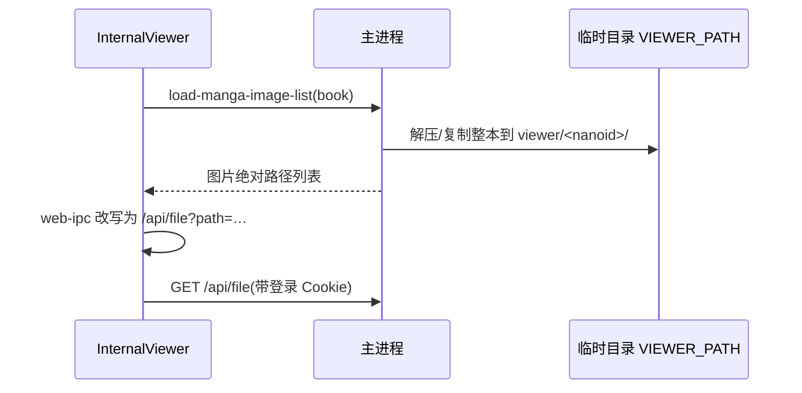

注意:`load-manga-image-list` 里有 `sendImageLock` 机制,避免连续快速切换漫画时并发解压把磁盘打满。

---

## 10. AI 功能

### 10.1 配置档(aiApiProfiles)

支持保存多个 OpenAI 兼容 API 配置,再给不同功能分别选用:

```json
"aiApiProfiles": [
  { "id": "xxx", "name": "本地 Ollama", "baseUrl": "http://192.168.1.5:11434/v1", "model": "qwen2.5:7b", "apiKey": "" }
],
"infoProcessApiProfileId": "xxx",     // 信息处理(标签/简介/翻译)
"upscaleApiProfileId": "xxx",         // 图片超分
"colorizeApiProfileId": "xxx",        // 上色
"ocrApiProfileId": "xxx"              // 文字提取
```

解析函数 `resolveAiProfile(profileId, fallback)`(index.js):命中配置档则用档内 `baseUrl/model/apiKey`,否则回退到旧的平铺字段(`openaiBaseUrl` 等)以兼容旧配置。

### 10.2 标题翻译

`modules/translate.js` 提供两条路径:

| 模式 | 说明 |
|---|---|
| `ollama` | 本地 Ollama,默认 `http://127.0.0.1:11434` |
| `openai` | 任意 OpenAI 兼容 `/chat/completions`(DeepSeek、Ollama 的 OpenAI 兼容端点等) |

另有 `list-title-translation-models`(列举可用模型)、`test-title-translation`(连通性测试)。
结果写入 `Mangas.title_cn` / `Metadata.title_cn`。

### 10.3 信息处理(标签/简介/类型)

`ai-process-book` / `ai-process-books-batch` 让模型从标题/简介中抽取结构化信息,
再由 `mergeBookInfo(book, info)` 合并进元数据:

| 抽取项 | 写入 |
|---|---|
| 中文标题 | `book.title_cn` |
| 角色 / 出处 / 作者 | 追加进 `book.tags.character` / `parody` / `artist`(去重) |
| 类型 | `book.category` |

可选处理任务在 `setting.infoProcessTasks`(`["tags","story","translate"]`),控制权在用户。

### 10.4 图片类 AI

| 功能 | 通道 | 后端 | 保存模式 |
|---|---|---|---|
| 超分 | `upscale-image` | 配置了 API 则 POST 图片二进制(支持二进制或 `{image: base64}` 响应);否则本地 Lanczos3 + 轻度锐化 | `upscaleSaveMode`:`same`(另存)/`replace`(替换原文件,先 `.bak` 备份)/`preview`(仅预览到 viewer) |
| 文字提取 | `extract-image-text` | OpenAI 兼容视觉接口(`image_url` data URI) | `ocrSaveMode` |
| 上色 | `ai-colorize-image` | POST 图片到 `/colorize` | `colorizeSaveMode` |
| 文本翻译 | `ai-translate-text` | `/chat/completions` | `ai-save-text` 决定是否落盘 |

> **v1.10.3 起**:「输出尺寸 / 超分倍数」已从设置界面移除(不同引擎能力不同,全局倍数没有意义),
> 倍数改为**每个本地模型自己的参数**(见 10.5.3)。`upscaleSizeMode` / `upscaleScale` / `upscaleTargetWidth`
> 三个旧键仍保留在代码与配置里,只作为 API 分支与内置 Lanczos 的兼容默认值。

批量 AI 任务可暂停:`set-ai-task-paused` 置位后,每个任务在 `waitIfAiPaused()` 处等待,不会丢失进度。

### 10.5 本地超分模型(Real-ESRGAN / waifu2x)

**定位**:把 ncnn-vulkan 版超分引擎下载到本机直接运行,**完全不依赖 API 服务**。

#### 10.5.1 模块与职责

`modules/localModels.js`(纯 `fs`/`path`,不依赖 electron,可脱离主进程单独测试):

| 导出 | 作用 |
|---|---|
| `MODELS` | 内置模型清单:各平台下载地址、可执行文件名、默认权重、约大小 |
| `init(dataDir)` | 设定模型根目录 = `<数据目录>/models/upscale` |
| `setProxy(url)` / `setMirror(prefix)` | 下载走代理 / 镜像前缀(国内直连 GitHub 大文件会被重置) |
| `list()` | 内置清单 + 本机安装状态(是否找到可执行文件、占用大小) |
| `listWeights(id)` | 扫描安装目录,列出可用权重 |
| `OPTION_SCHEMA` / `defaultOptionsOf(id)` | 参数描述与默认值(前端据此渲染 UI) |
| `download(id, onProgress)` / `cancel(id)` / `remove(id)` | 下载(流式 + 进度)、取消、卸载 |
| `runUpscale(id, in, out, opts)` | 调用引擎执行超分 |

安装状态**不落库**,每次 `list()` 实时探测:在安装目录里递归找可执行文件,找到即视为已安装。

#### 10.5.2 安装目录与权重发现

```
<数据目录>/models/upscale/
├── realesrgan/
│   ├── realesrgan-ncnn-vulkan              可执行文件
│   └── models/                             权重(realesrgan-x4plus.param/.bin 等)
└── waifu2x/
    └── waifu2x-ncnn-vulkan-20220728-ubuntu/
        ├── waifu2x-ncnn-vulkan
        ├── models-cunet/                   权重目录(即 -m 的取值)
        ├── models-upconv_7_anime_style_art_rgb/
        └── models-upconv_7_photo/
```

> 各版本发布包解压后的顶层目录结构并不一致(Real-ESRGAN 用 7z 解会**把顶层目录拉平**),
> 所以可执行文件一律用**递归查找**;运行时把 `cwd` 设为可执行文件所在目录 ——
> ncnn-vulkan 靠相对路径 `models/` 找权重。

权重列表同样是**扫描得来**,不硬编码:

- Real-ESRGAN:`models/*.param` 的文件名(传给 `-n`)
- waifu2x:同级的 `models-*` 目录名(传给 `-m`)

#### 10.5.3 参数与设置项

`setting.localUpscaleOptions.<模型id>` 保存每个模型自己的参数,由 `OPTION_SCHEMA` 描述可调项:

| 模型 | 参数 |
|---|---|
| Real-ESRGAN | `model`(权重) / `scale`(2/3/4) / `tileSize` / `gpuId` / `tta` |
| waifu2x | `model`(权重目录) / `scale`(1/2) / `noiseLevel`(-1~3) / `tileSize` / `gpuId` / `tta` |

前端**不写死字段**:`local-model-weights` 返回 schema + 当前值 + 可用权重,设置页按 `type` 渲染
(`weights` → 下拉、`select` / `number` / `bool` 各自对应控件)。
**新增模型只需在 `OPTION_SCHEMA` 补一段,前端零改动。**

参数映射到命令行:

```bash
# Real-ESRGAN
realesrgan-ncnn-vulkan -i in -o out -n realesrgan-x4plus -s 4 [-t 128] [-g 0] [-x]

# waifu2x
waifu2x-ncnn-vulkan   -i in -o out -m models-cunet -s 2 -n 0 [-t 128] -g 0 [-x]
```

> `-s` 是**二次缩放**:选了 `animevideov3-x2` 又设 4 倍,会先 x2 再插值到 x4。建议倍数与权重自带的倍数一致。

#### 10.5.4 引擎调度

`upscale-image` 的引擎优先级:**本地模型 > API 服务 > 内置 Lanczos**。

本地模型与 API 在设置页是**同一个下拉**(「使用的模型」),内部用 `local:` / `api:` 前缀区分,
分别落到 `localUpscaleEngine` / `upscaleApiProfileId` 两个键 —— 数据结构不变,旧配置免迁移。

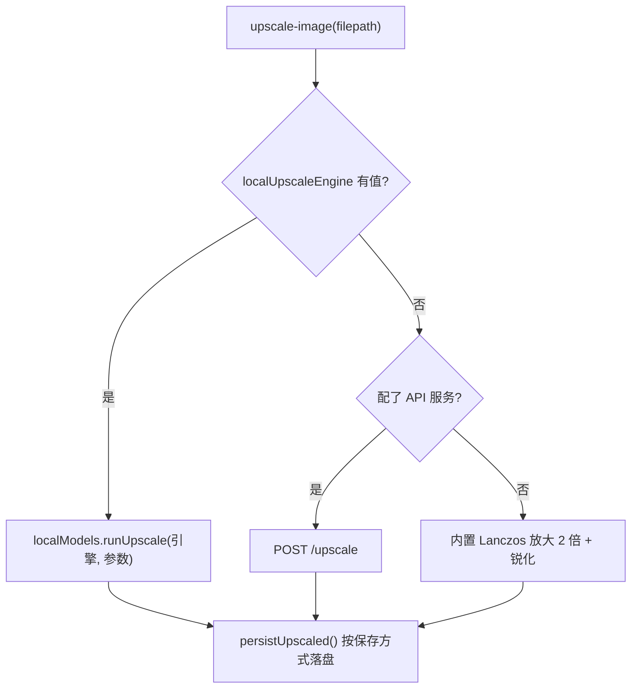

#### 10.5.5 结果落盘(v1.10.3 新增)

由 `persistUpscaled()` 统一处理(`setting.upscaleSaveMode`):

| 模式 | 行为 |
|---|---|
| `preview` | 只留在 `<数据目录>/tmp/`,返回该临时路径 |
| `same` | 原图同目录生成 `原名_upscaled.扩展名`(重名自动加序号) |
| `replace` | 覆盖原文件,旧文件备份为 `.bak` |

两个必须注意的边界:

1. **压缩包漫画的图是解压产物**(路径在 `viewer/` 或 `tmp/` 下),写回压缩包不现实 ——
   这种情况统一另存到 `<数据目录>/upscaled/`,并且 `replace` 会退化为另存 + 给出提示;
2. 转存时**按目标扩展名重新编码**(png 无损 / jpg 质量 95 / webp 95 / avif 60),
   避免把带透明通道的 png 存成 jpg。

返回体带 `saved` / `mode` / `savePath` / `note`,阅读器据此给出不同提示。

> ⚠️ v1.10.3 之前 `upscaleSaveMode` 是**死设置**:后端从未读取它,`upscale-image` 永远只输出到预览目录,
> 表现为「选了保存到文件夹但文件没出现」。

#### 10.5.6 平台差异:Vulkan 是硬门槛

ncnn-vulkan 引擎**必须有 Vulkan**:

| 环境 | 情况 |
|---|---|
| Windows 桌面版 | 显卡驱动自带 Vulkan,开箱可用 |
| NAS / Docker(Linux) | 容器默认没有 Vulkan → 镜像内安装 `libvulkan1 + mesa-vulkan-drivers + libgomp1`,用 **lavapipe 做 CPU 软件渲染** |

实测性能(NAS,CPU 软渲染):

| 引擎 | 输入 → 输出 | 耗时 |
|---|---|---|
| waifu2x | 200x150 → 400x300 | 7.9 s |
| waifu2x | 600x400 → 1200x800 | 34.7 s |
| waifu2x | 1000x1400 → 2000x2800 | 183 s |
| Real-ESRGAN(x4) | 200x150 → 800x600 | 124 s |

> 结论:NAS 上能用但慢 —— 优先选 waifu2x,必要时把「放大倍数」设为 1(只降噪不放大)。

#### 10.5.7 IPC 通道与进度事件

| 通道 | 说明 |
|---|---|
| `local-model-list` | 清单 + 安装状态 + 当前引擎 + 模型根目录 |
| `local-model-download` | 后台下载并解压,进度通过 `local-model-progress` 事件推送 |
| `local-model-cancel` | 中断下载(AbortController)并清理半成品目录 |
| `local-model-delete` | 删除模型(若正是当前引擎则同时清空选择) |
| `local-model-weights` | 某模型的可用权重 + 参数 schema + 当前值 |
| `local-model-open-dir` | 打开模型安装目录 |

进度事件 `local-model-progress` 的 `phase` 取值:
`start` / `download` / `extract` / `installed` / `cancelled` / `error`;
桌面版走 `webContents.send`、网页版走 SSE,前端统一用 `ipcRenderer.on` 接收。

#### 10.5.8 已知坑

- **直连 GitHub 下载大文件会被重置**(实测 `read ECONNRESET`)→ 下载支持两条路:
  `setting.proxy`(复用「常用 → 代理」)与 `setting.localModelMirror`(镜像前缀);
- **Docker 构建慢**:`mesa-vulkan-drivers` 会拖进 `libllvm15` 等约 60 MB 依赖,
  NAS 上首次构建的 apt 阶段要 10 分钟左右(之后有层缓存);
- **只读账户(viewer)看不到超分入口**:前端 `viewerRole` 会过滤掉 `upscaleImage` 等写操作项。

---
## 11. 构建与部署

### 11.1 Docker 镜像(三阶段构建)

`Dockerfile` 用多阶段把「构建工具链」与「运行时」分离:

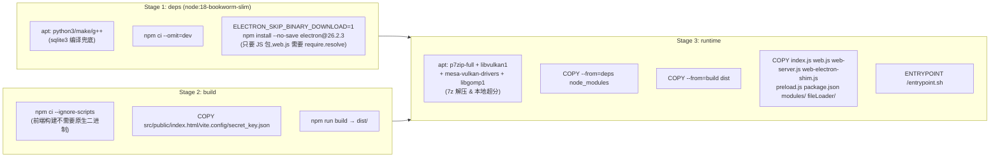

国内网络适配(Dockerfile 顶部的 ENV):

| 变量 | 目标 |
|---|---|
| `npm_config_registry` | `registry.npmmirror.com` |
| `npm_config_sharp_libvips_binary_host` / `SHARP_LIBVIPS_BINARY_HOST` | sharp 的 libvips 预编译包 |
| `npm_config_sqlite3_binary_host_mirror` | sqlite3 预编译包 |
| `ELECTRON_MIRROR` / `ELECTRON_CUSTOM_DIR` | electron 二进制 |

**关键约束**:镜像里不能出现 `/app/data` 或 `/app/portable`,否则数据目录会落到镜像层(见 2.2)。
**运行阶段还装了两组系统依赖**(见 11.3 与 10.5.6):

| 包 | 用途 |
|---|---|
| `p7zip-full` | rar / 7z / cb7 / cbr 的解压、封面生成、删页 |
| `libvulkan1` + `mesa-vulkan-drivers` + `libgomp1` | 本地超分模型(ncnn-vulkan)需要 Vulkan 运行时;容器无 GPU 时用 mesa 的 **lavapipe 走 CPU 软件渲染** |

> 注意:`mesa-vulkan-drivers` 会连带拉入 `libllvm15`(23 MB)等依赖,合计约 60 MB。
> 在 NAS 上首次构建的 apt 阶段实测要 **10 分钟左右**(之后该层有缓存,重建很快)。

### 11.2 容器入口(entrypoint.sh)

```sh
mkdir -p "$DATA_DIR"
if [ ! -f "$DATA_DIR/setting.json" ]; then
  # 写入一份内联的默认 setting.json(library 指向 $LIBRARY_DIR)
fi
# 若检测到 library 仍是 Windows 路径,打印提示
exec node /app/web.js
```

沿用 3.1 的结论:**它只在文件不存在时写入**。

### 11.3 Windows 打包

```bash
npm run build                  # vite build → dist/
npx electron-builder --win      # → out/ : NSIS 安装包 + 免安装 zip
```

`package.json` 的 `build.files` 决定打进 asar 的内容:`dist/`、`fileLoader/`、`modules/`、`public/`、`index.js`、`preload*.js`;
`extraResources` 打进 `resources/extraResources/`(含 `manga_reader.exe`、`7z.exe`)。

#### 已知坑 1:NSIS 报 unable to read icon from file

**根因不是路径编码,而是 .ico 文件本身被破坏**。实测结论:

| 现象 | 说明 |
|---|---|
| `makensis` 报 `Error while loading icon ... unable to read icon` | 连纯英文路径(`C:\emm-build`)下同样失败,排除中文路径因素 |
| 文件比对 | 仓库中的 `public/icon.ico` 比上游少 1 字节 |
| 原因 | **`core.autocrlf=true` 把二进制里的 `0D 0A` 当文本换行处理**,PNG 签名 `89 50 4E 47 0D 0A 1A 0A` 变成 `89 50 4E 47 0A 1A 0A` |
| 连锁反应 | ICO 内部各图像条目的偏移是绝对偏移,少 1 字节后整块错位,makensis 无法解析 |

**修复**:用正确的 ico 覆盖 + 新增 `.gitattributes` 声明二进制类型(见 11.4)。

#### 已知坑 2:打包后原生模块消失

electron-builder 的 rebuild/清理流程可能把 `node_modules/sqlite3/lib/binding/.../node_sqlite3.node` 删除,只留下 `.DELETE.<hash>` 标记文件,导致应用启动即崩。
打包后应确认这两个文件存在:

```
node_modules/sqlite3/lib/binding/napi-v6-win32-unknown-x64/node_sqlite3.node
node_modules/sharp/build/Release/sharp-win32-x64.node
```

### 11.4 二进制文件保护(.gitattributes)

```gitattributes
*.png binary
*.ico binary
*.jpg binary
*.exe binary
*.node binary
*.zip binary
*.tar.gz binary
*.sqlite binary
# ... 其余见文件
```

`binary` 等价于 `-text -diff`,即**禁止任何行尾转换**。任何新增的二进制资源类型都应补进这个文件。

> ⚠️ 修改 `.gitattributes` 后,已提交的损坏二进制需要**重新提交正确版本**才会修正工作区内容。

### 11.5 版本号与发版流程

版本号出现的位置(改版本时必须同步):

| 位置 | 用途 |
|---|---|
| `package.json` 的 `version` | 应用版本,`/api/info` 与窗口标题取自此 |
| `docker-compose.yml` 的 `image:` | 镜像 tag |
| `CHANGELOG.md` 顶部 | 变更说明 |
| `RELEASE-v*.md` | GitHub Release 正文 |
| `使用说明.md` 版本记录表 | 用户向 |

标准流程:

```bash
# 1. 改版本号 + 写 CHANGELOG
# 2. 构建前端与安装包
npm run build && npx electron-builder --win
# 3. NAS 重建镜像
cd /vol1/1000/docker/exhentai-manga-manager && sudo docker compose up -d --build
# 4. 导出镜像包
sudo docker save exhentai-manga-manager:<版本> | gzip -1 > docker-images/<文件名>.tar.gz
# 5. 提交推送 + 打 tag
git push origin main && git push origin v<版本>
# 6. GitHub Release 上传资产(安装包 / 绿色版 / 镜像包)
```

> 大文件**不要直接提交进 git 仓库**:GitHub 单文件上限 100MB,且 `.gitignore` 已排除 `out/`、`*.tar.gz`。
> 正确做法是作为 **Release 资产**上传。

---

## 12. 排障手册

### 12.1 按现象查

| 现象 | 最可能原因 | 检查/处理 |
|---|---|---|
| **设置反复丢失** | v1.9.8~v1.10.0 的保存缺陷(见 3.7) | 升级到 1.10.1;用 `_recover_backup_*/BASE_setting.json` 恢复 |
| 容器重建后数据库/设置消失 | `/data` 未挂载或挂到了错误路径 | `docker inspect` 看 Mounts;确认没有 `/app/data` 触发便携模式 |
| 图片 401 / 封面不显示 | 1.10.1 起 `/api/file` 需要登录 | 正常登录后刷新;或把访问 IP 加入白名单 |
| 浏览器打开图片链接是 Unauthorized | 同上(未带 Cookie) | 预期行为 |
| 局域网内匿名能看后台 | 未配置 `WEB_ADMIN_PASSWORD` | 配好环境变量并重启容器 |
| viewer 看不到漫画 | `load-setting` 不在白名单 | 检查 `VIEWER_ALLOWED_CHANNELS` |
| viewer 能改数据 | 写操作被误加入白名单 | 从白名单移除(安全边界只在服务端) |
| 扫描很慢 | 封面懒加载失效 / 首次扫描 | 确认 `geneCover` 传 `null`;首次全量属正常 |
| 扫描后大量记录消失 | 安全阀阈值内属正常清理;或漫画库掉线 | 看日志「清理了 N 本」;掉线时会提示「扫描结果异常」 |
| 增量扫描不生效 | 快照缺失 / 库路径或排除规则变了 | 会自动转全量并重建快照 |
| 文件被移动后标签丢了 | 「搬家检测」未命中 | `findSameFile` 依赖 `bundleSize+mtime`,改动文件会失配 |
| 阅读图片串图 | 浏览器缓存了 `viewer/` 临时图 | 阅读图响应已带 `no-store`;检查反向代理是否覆盖了 Cache-Control |
| 远程模式设置不生效 | 通道未在本地代理拦截 | 见 7.3,补拦截分支 |
| 远程模式一直「无法连接 NAS」 | Cookie 失效 / 地址错 / 端口不通 | 看 `/api/info` 的 `proxyError`;重进设置页重新登录 |
| 客户端重启后排序、阅读进度丢失 | 代理端口变了(origin 变化导致 localStorage 隔离) | 确认 `PROXY_BASE_PORT` 固定为 23886 |
| NAS 构建失败 | npm/electron 下载超时 | 检查 Dockerfile 的 npmmirror ENV 是否还在 |
| 容器里 rar/7z 解压失败 | 缺 p7zip | 确认镜像装了 `p7zip-full` |
| 打包报 unable to read icon | ico 被行尾转换破坏 | 见 11.3 坑 1 |
| 打包后应用起不来 | 原生模块被删 | 见 11.3 坑 2 |
| 白名单规则丢失 | 保存时被非白名单数据覆盖 | 保存前读回确认(历史 bug,已修) |
| 选了「保存到文件夹」但没生成文件 | v1.10.3 之前 `upscaleSaveMode` 是死设置 | 升级到 1.10.3;见 10.5.5 |
| 本地模型下载失败(ECONNRESET) | 直连 GitHub 被重置 | 配「常用 → 代理」或「本地模型 → 下载源」镜像前缀 |
| 本地模型下载完成但选择框是灰的 | 解压后没找到可执行文件 | 看模型卡片的报错;确认发布包结构未变(见 10.5.2) |
| 超分报 Vulkan 相关错误 | 运行环境没有 Vulkan | Windows 装显卡驱动;Docker 需镜像含 mesa-vulkan-drivers |
| 超分很慢 | 无 GPU,走 CPU 软件渲染 | 见 10.5.6 的性能表;改 waifu2x 或把倍数设为 1 |
| 阅读器图片右键少了「超分图片」 | 旧版有两个无 UI 的幽灵开关(`enableImageUpscale`) | v1.10.3 已移除,现在只看右键菜单勾选 |

### 12.2 必查的三个文件与两个目录

| 对象 | 位置 | 能回答什么 |
|---|---|---|
| `setting.json` | 数据目录 | 配置是否完整(被清空会只剩 `contextMenuOptions`) |
| `users.json` | 数据目录 | 账户是否启用、角色 |
| `scan-snapshot.json` | 数据目录 | 增量扫描快照是否有效 |
| `cover/` | 数据目录 | 封面文件(两端共享) |
| `viewer/` | 数据目录 | 阅读临时图(可安全清空) |

### 12.3 常用排查命令

```bash
# 容器状态与挂载
sudo docker ps --filter name=exhentai-manga-manager
sudo docker inspect exhentai-manga-manager --format '{{range .Mounts}}{{.Source}} => {{.Destination}}{{"\n"}}{{end}}'

# 服务信息(公开接口)
curl -s http://127.0.0.1:10000/api/info

# 鉴权自检:未登录应为 401
curl -s -o /dev/null -w "%{http_code}" "http://127.0.0.1:10000/api/file?path=/data/setting.json"

# 容器内统计配置键数量(大量键缺失 ⇔ 设置被清空)
sudo docker exec exhentai-manga-manager node -e "const j=require('/data/setting.json');console.log(Object.keys(j).length)"
```

---
## 13. 附录

### 13.1 文件清单与职责

| 路径 | 职责 |
|---|---|
| `index.js` | 主进程:窗口/托盘/扫描/封面/设置/AI/远程代理/全部 IPC |
| `web.js` | 网页版入口(劫持 electron 模块缓存后加载 index.js) |
| `web-server.js` | Express 服务:静态资源、`/api/ipc`、SSE、`/api/file`、`/api/list-dir`、`/browse`、鉴权 |
| `web-electron-shim.js` | Electron API 的纯 Node 兼容层 |
| `preload.js` / `preload-remote.js` | 桌面版渲染进程桥 |
| `modules/init_folder_setting.js` | 数据目录定位、`setting.json`/`collectionList.json` 读写 |
| `modules/auth.js` | 账户、会话、scrypt |
| `modules/iprules.js` | IP 黑白名单(单 IP / CIDR) |
| `modules/database.js` | Sequelize 模型(Mangas / Metadata) |
| `modules/translate.js` | AI 翻译与文本抽取 |
| `modules/prepare_menu.js` | 桌面应用菜单 |
| `modules/utils.js` | `getRootPath()` |
| `fileLoader/index.js` | 封面生成、图片列表、删图的统一入口 |
| `fileLoader/folder.js` | 文件夹漫画(含「搬家检测」`findSameFile`) |
| `fileLoader/archive.js` | rar/7z/cb7/cbr(7z 调用) |
| `fileLoader/zip.js` | zip/cbz(adm-zip 优先) |
| `fileLoader/incremental.js` | 目录指纹清单与增量差异 |
| `src/main.js` | 前端入口 |
| `src/App.vue` | 主界面 |
| `src/components/Setting.vue` | 设置面板(实际使用的版本) |
| `src/web-ipc.js` | 浏览器 IPC 桥 |
| `src/pinia.js` | 全局 store |
| `src/utils.js` | 主题/封面样式/右键菜单定义等前端工具 |
| `src/aiTasks.js` | 单本书 AI 任务编排 |
| `Dockerfile` / `docker/entrypoint.sh` | 容器构建与入口 |
| `docker-compose.yml` | 部署编排 |

> ⚠️ 仓库根目录还残留 `App.vue`、`Setting.vue`、`init_folder_setting.js` 等**历史副本**,构建入口是 `index.html → src/main.js`,这些根文件不参与构建。修改时不要改错文件。

### 13.2 IPC 通道全表

按功能分组(`ipcMain.handle` 注册;网页版经 `POST /api/ipc/:channel`)。

#### 设置与数据目录

| 通道 | 说明 |
|---|---|
| `load-setting` | 读取设置(viewer 脱敏) |
| `save-setting` | 保存设置(**合并语义**,见 3.4) |
| `get-data-path` | 当前数据目录 / 默认数据目录 / 是否便携 |
| `set-data-path` | 写 `bootstrap.json` 并重启 |
| `export-database` / `import-database` | 导出/导入元数据与合集 |
| `import-sqlite` | 导入 ExHentai 元数据 sqlite |

#### 漫画库与扫描

| 通道 | 说明 |
|---|---|
| `load-book-list` | 加载列表;`scan=true` 触发全量扫描(viewer 被拒) |
| `incremental-scan` | 增量扫描 |
| `force-gene-book-list` | 清库重建(清空封面) |
| `get-folder-tree` | 文件夹树 |
| `ensure-book-cover` | 按需生成/获取封面 |
| `load-manga-image-list` | 解出整本图片供阅读 |
| `save-book` | 保存单本(manga + metadata) |
| `patch-local-metadata` / `patch-local-metadata-by-book` | 批量打标 |
| `delete-local-book` / `move-local-book` | 删除/移动载体 |
| `delete-image` / `rename-image` | 阅读器内图片操作 |
| `use-new-cover` | 指定封面图 |
| `get-ehviewer-data` | 读取 EhViewer 数据 |

#### 元数据抓取

| 通道 | 说明 |
|---|---|
| `get-ex-webpage` / `post-data-ex` | 代理访问 ExHentai(带 Cookie) |
| `update-tag-translation` | 下发标签翻译表 |
| `rename-tag` / `delete-tag` | 全库重命名/删除标签 |

#### 合集与收藏

| 通道 | 说明 |
|---|---|
| `load-collection-list` / `save-collection-list` | 合集 |

#### 阅读与查看

| 通道 | 说明 |
|---|---|
| `set-viewer-active` | 告诉主进程「用户正在阅读」(扫描让路) |
| `release-sendimagelock` | 释放图片发送锁 |
| `open-local-book` / `show-file` / `open-library-folder` | 打开文件/目录 |
| `get-default-manga-reader` | 外部阅读器 |

#### AI

| 通道 | 说明 |
|---|---|
| `translate-book-title` / `translate-book-titles-batch` | 标题翻译 |
| `test-title-translation` / `list-title-translation-models` | 连通性与模型列表 |
| `ai-process-book` / `ai-process-books-batch` | 信息处理 |
| `analyze-book-title-characters` / `...-batch` | 标题角色分析 |
| `query-character-origins` | 角色出处查询 |
| `ai-list-images` | 列出书内图片 |
| `ai-translate-text` / `ai-save-text` | 文本翻译与保存 |
| `ai-colorize-image` | 上色 |
| `upscale-image` | 超分(引擎优先级:本地模型 > API > 内置) |
| `local-model-list` / `local-model-weights` | 本地模型清单与可用权重(见 10.5.7) |
| `local-model-download` / `local-model-cancel` / `local-model-delete` | 本地模型下载/取消/删除 |
| `local-model-open-dir` | 打开本地模型目录 |
| `extract-image-text` | 文字提取(OCR) |
| `set-ai-task-paused` | 暂停/继续批量 AI |

#### 桌面窗口与系统(网页版为本地拦截或空实现)

| 通道 | 说明 |
|---|---|
| `get-window-state` / `window-minimize` / `window-toggle-maximize` | 窗口 |
| `window-set-always-on-top` / `window-toggle-always-on-top` | 置顶 |
| `update-window-title` / `switch-fullscreen` / `set-progress-bar` | 标题/全屏/进度 |
| `relaunch-app` / `switch-to-local-mode` | 重启/退出远程模式 |
| `test-remote-server` | 连接测试 |
| `enable-LAN-browsing` | 局域网浏览(网页版恒为 false) |

#### 剪贴板 / 系统信息 / 文件选择

| 通道 | 说明 |
|---|---|
| `copy-text-to-clipboard` / `read-text-from-clipboard` / `copy-image-to-clipboard` | 剪贴板 |
| `get-locale` / `get-path-sep` | 系统信息 |
| `select-folder` / `select-file` | 选择器(网页版由前端目录对话框实现) |
| `open-url` | 打开外链 |
| `import-custom-asset` | 导入自定义主题资源 |

### 13.3 设置项分组(`setting.json`)

| 分组 | 代表键 |
|---|---|
| 库与数据 | `library`、`metadataPath`、`excludeFile`、`externalLibraryRoot`、`externalMetadataPath`、`externalCoverRoot`、`windowsLibraryRoot` |
| ExHentai | `igneous`、`ipb_pass_hash`、`ipb_member_id`、`star`、`proxy` |
| 界面 | `theme`、`themeCustom*`、`customIconPath`、`appName`、`language`、`scrollInertiaLevel`、`pageSize`、`customPageSizes` |
| 卡片 | `coverWidth`、`coverHeight`、`cardGapV`、`cardGapH`、`fillCover`、`hide*` 系列 |
| 工具栏 | `toolbarButtons` |
| 右键菜单 | `contextMenuOptions` |
| 阅读 | `viewerType`、`keepReadingProgress`、`hidePageNumber`、`directEnter`、`requireGap`、`showComment`、`displayTitle`、`trimTitleRegExp` |
| 标签 | `showTranslation`、`showCollectTag`、`randomTagsEnabled`、`collectTag`、`tagNameLangs`、`tagRelations`、`tagGenCategories` |
| AI | `aiApiProfiles`、`*ApiProfileId`、`ollama*`、`openai*`、`titleTranslation*`、`infoProcess*`、`upscale*`、`colorize*`、`ocr*`、`translateTargetLang` |
| 本地模型 | `localUpscaleEngine`、`localUpscaleOptions.<模型id>`、`localModelMirror` |
| 桌面专属 | `remoteServer`、`webUsername`、`webPassword`、`startOnLogin`、`alwaysOnTop`、`globalHotkey`、`minimizeOnStart`、`minimizeToTray`、`closeToTray` |

### 13.4 安全边界(修改代码前对照)

| 边界 | 位置 | 规则 |
|---|---|---|
| 登录 | `web-server.js` `requireLogin` | `/api/file`、`/api/list-dir`、`/browse`、`/api/events`、`/api/ipc/*` 需登录 |
| 只读账户 | `VIEWER_ALLOWED_CHANNELS` | **默认拒绝**,只放只读通道;写操作永不加白名单 |
| 敏感脱敏 | `VIEWER_SETTING_BLOCKLIST` | viewer 读设置时剔除 Cookie / API Key / 代理 |
| 文件读取 | `allowedRoots()` | 只允许数据目录 / 漫画库 / 元数据目录及其子路径 |
| 密码 | `modules/auth.js` | scrypt + 每用户盐,不存明文 |
| 远端口 | `startRemoteProxy` | 代理只监听 `127.0.0.1`,不对外暴露 |
| 误删保护 | `runScan` / `runIncrementalScan` | 命中率或目录消失率超阈值时跳过清理 |
| 覆盖保护 | 多处 | 设置/快照用临时文件 + rename 原子写 |

### 13.5 修改代码时的检查清单

新增**设置项**时:

1. `modules/init_folder_setting.js` 补默认值;
2. `docker/entrypoint.sh` 的内联默认值按需补(可选,前端会兜底);
3. `src/components/Setting.vue` 补 UI 与默认值兜底;
4. `index.js` 补生效逻辑;
5. 若该键需要在远程模式下存本机,加入 `CLIENT_SETTING_KEYS`。

新增**IPC 通道**时:

1. `index.js` 注册 handler;
2. 判断是否属于「只读」:只读才考虑加入 `VIEWER_ALLOWED_CHANNELS`;
3. 若是桌面专属(窗口/托盘等),在远程代理 `startRemoteProxy` 里加**本地拦截分支**;
4. 前端调用处注意 `web-ipc.js` 的路径改写规则。

新增**文件服务路由**时:

1. 挂上 `requireLogin`;
2. 路径必须过 `allowedRoots()` 前缀校验;
3. 明确缓存策略(稳定文件长缓存、临时文件 `no-store`)。

---

> 文档维护提示:本文件与源码同步演进。修改上述任一机制时,请回到对应章节更新描述,
> 尤其是这几处最容易随改动失真:
>
> - **3.4 设置的保存语义**(合并 vs 替换)
> - **4.6 鉴权矩阵**(哪些路由需要登录)
> - **8.4 增量扫描算法**(快照结构变更)
> - **10.5 本地超分模型**(模型清单 / 参数 schema / 保存策略 / 平台性能)


---

## 12. 多漫画库(v1.11.0)

### 12.1 数据模型

\`\`\`jsonc
// setting.json
{
  "libraries": [
    { "id": "lib-xxxxxxxxxx", "name": "漫画", "path": "Y:\\01-漫画", "dataPath": "D:\\emm-data\\libraries\\漫画" }
  ],
  "activeLibraryId": "lib-xxxxxxxxxx",   // 活动库(扫描锚点 / 旧代码兜底)
  "switchBoxes": [ { "id": "box-xxxxxxxx", "libraryIds": ["lib-xxxxxxxxxx"] } ],
  "activeBoxIndex": 0,
  "library": "Y:\\01-漫画"                // 兼容:始终镜像活动库的 path
}
\`\`\`

- **全局数据**(所有库共用):\`setting.json\`、\`metadata.sqlite\`(标签/评分/标题)、账户、本地模型、合集、日志 —— 全部位于「数据存放目录」。全局数据库路径由 \`metadataPath\` 决定,默认 = 数据存放目录。
- **每库数据**:\`database.sqlite\`(书库)、\`scan-snapshot.json\`(增量扫描)、\`viewcache/\`(缩略图)、\`cover/\`(封面)、\`delete-log.jsonl\`(删除记录) —— 位于该库的「库数据存放位置」。
- 解析函数:\`modules/libraries.js\` 的 \`libraryDataDir(storePath, lib)\` / \`libraryRuntimePaths(storePath, lib)\`。

### 12.2 生效条件(第 3 条方案 C)

\`\`\`js
isLibraryActive(lib) = !!(lib && lib.path && String(lib.dataPath || '').trim())
\`\`\`

- 未生效的库:**不加载、不扫描、不能设为活动库、不能加入切换框**(设置页显示「未生效」并置灰)。
- \`activeLibraryOf(setting)\` / \`boxLibraries(setting)\` 都只考虑已生效的库。

### 12.3 运行时状态(模块级可变变量)

| 变量 | 含义 | 谁改它 |
|---|---|---|
| \`Manga\` | 当前打开的库的 sequelize 模型 | \`openLibraryForScan\` / \`switchActiveLibraryRuntime\` / \`modelForLibrary\` |
| \`LIBRARY_DATA_DIR\` | 当前库数据目录 | 同上 |
| \`LIBRARY_VIEWCACHE_DIR\` | 当前库缩略图缓存 | 同上 |
| \`CURRENT_COVER_DIR\` | 当前库封面目录 | 同上 |
| \`SNAPSHOT_FILE\` / \`LIBRARY_DB_FILE\` | 当前库快照 / 数据库 | 同上 |
| \`setting.library\` | 当前库的漫画根目录 | 同上(兼容老代码) |

> ⚠️ 这些全局变量是"扫描上下文"的唯一来源。**所以扫描期间不要手工替换它们**;扫描自身通过 \`openLibraryForScan\` 逐个库切换。
> 切「切换框」(\`set-active-box\`)**不碰**这些变量,只改 \`activeBoxIndex\`,因此扫描中也能切换框。

### 12.4 合并书架(\`loadBookListFromDatabase\`)

1. \`boxLibraries()\` 取当前框内所有已生效的库(无框 → 全部已生效库;框存在但没勾 → 也视作全部);
2. 逐个库 \`await modelForLibrary(lib.id).findAll()\`,每行补 \`libraryId\` / \`libraryName\`,并做路径翻译(跨平台);
3. 读取全局 \`Metadata\` 全表,建 \`hash → metadata\` 索引;
4. 每本书:全局有同 hash → **用全局记录覆盖书**(含 \`tags\` / \`status\`)→ 全局优先;
5. 全局缺失的书 → 收集后**单事务** \`upsert\` 进全局表(避免逐条 fsync)。

### 12.5 写入路由

| 场景 | 落点 |
|---|---|
| \`saveBookToDatabase(book)\` | \`modelForLibrary(book.libraryId)\` 的 \`Mangas\` + 全局 \`Metadata\` |
| 封面路径回写 \`updateBookCoverPath(id)\` | \`modelForBookId(id)\`(由 \`bookLibraryById\` 反查) |
| 按 id / filepath / hash 查一本书 | \`findBookAcrossLibraries(where)\`:在「框内所有库 + 当前库」里依次查,返回 \`{model,row,libraryId}\` |
| 删除 / 移动 / 文件夹树 | \`libraryForPath(absPath)\` 按 **路径前缀最长匹配** 找所属库 |

映射表在 \`loadBookListFromDatabase\` 时由 \`rememberBookLibrary(book)\` 登记。

### 12.6 扫描调度(\`runScanAll\`)

\`\`\`
load-book-list(true)
  └─ runScanAll()
       ├─ for lib of boxLibraries():          // 依次,不并发
       │     await openLibraryForScan(lib)    // 切数据库/快照/缓存/封面目录 + setting.library
       │     await runScan()                  // 原单库扫描逻辑,写该库自己的 database.sqlite
       └─ 恢复到活动库的运行时
\`\`\`

### 12.7 相关 IPC

| 通道 | 作用 |
|---|---|
| \`get-libraries\` | 返回 \`{libraries(含 active/dataDir), activeLibraryId, switchBoxes, activeBoxIndex, boxLibraryIds}\` |
| \`apply-libraries\` | 提交整份库列表 + 切换框;处理改名 / 改数据目录的迁移;活动库变化时重建运行时;扫描中拒绝 |
| \`set-active-library\` | 切换活动库(拒绝未生效的库) |
| \`set-active-box\` | 切到指定 / 下一个切换框;**只改 \`activeBoxIndex\`**,不重建运行时(所以扫描中可用) |
| \`get-all-tags\` | 全局标签去重列表(来自 \`metadata.sqlite\`) |

### 12.8 前端要点

- 工具栏「切换库」按钮:点击 = 切下一条框(循环);序号由**前端算好**再传给后端,避免前后端状态不同步。
- Options API 的模板**拿不到** \`<script>\` 里的 import 绑定,图标必须经 computed 暴露,否则按钮空白。
- \`applyLibraries()\` 成功后**一律** \`emit('loadBookList')\`(不传参),让增删库 / 改数据目录 / 改框立即生效。
- 设置页「库切换」框的候选列出**全部**库,未生效的加后缀并禁用。

### 12.9 已知限制

- 容器(网页版)里 \`libraries[].path\` 的 Windows ↔ \`/library\` 双向落盘尚未实现(目前只有 \`setting.library\` 会转换)。
- 活动库(\`activeLibraryId\`)仍是扫描锚点与老代码兜底;若彻底移除,需要把 \`runScan\` 里对上述全局变量的直接引用改成显式参数传递。
- 建议把「库数据存放位置」指向本地磁盘:SQLite 在网络盘上有锁失效与损坏风险。
